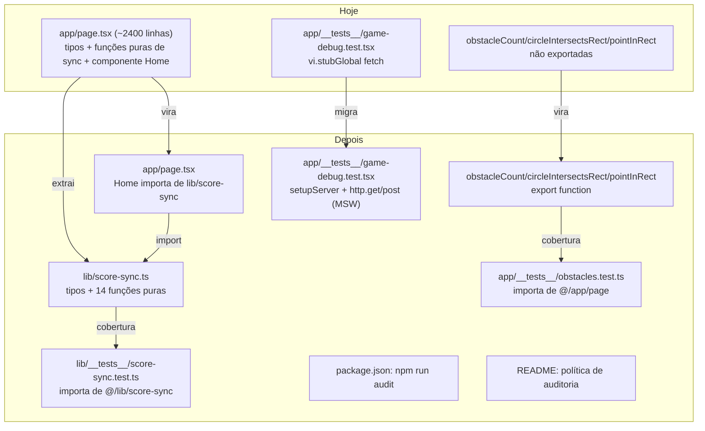

# Estabilidade e Qualidade — Fase 2 Design

**Spec**: `_docs/specs/features/estabilidade-qualidade-fase2/spec.md`
**Context**: `_docs/specs/features/estabilidade-qualidade-fase2/context.md`
**Status**: Draft

---

## Architecture Overview

Quatro mudanças independentes, sem arquitetura nova — só reorganização e cobertura de teste. Nenhum runtime novo, nenhuma dependência nova (MSW e `npm audit` já existem no projeto).

---

## Code Reuse Analysis

### Existing Components to Leverage

| Component | Location | How to Use |
| --- | --- | --- |
| Padrão MSW (`setupServer`, `http.get/post`, contador local para POST) | `app/__tests__/score-sync.test.tsx` | Copiar o mesmo padrão (não reinventar) para `game-debug.test.tsx` |
| Convenção de módulo `lib/*.ts` + `lib/__tests__/*.test.ts` | `lib/high-scores.ts`, `lib/score-idempotency.ts`, `lib/score-rate-limit.ts`, `lib/score-abuse-preflight.ts` | `lib/score-sync.ts` segue a mesma convenção de nomeação e de teste colocado |
| `obstacleCount` já pura e module-level | `app/page.tsx:155` | Só adicionar `export`, sem mover |
| `circleIntersectsRect`/`pointInRect` já puras e module-level | `app/page.tsx:183,192` | Só adicionar `export`, sem mover |

### Integration Points

| System | Integration Method |
| --- | --- |
| `app/page.tsx` (componente `Home`) | Passa a importar tipos e funções de `@/lib/score-sync` em vez de defini-los localmente |
| `app/__tests__/game-debug.test.tsx` | Passa a interceptar `/api/scores` via MSW em vez de `vi.stubGlobal("fetch", ...)` |
| `package.json` | Novo script `"audit": "npm audit --audit-level=high"` |

---

## Components

### `lib/score-sync.ts` (novo módulo)

- **Purpose**: Concentrar os tipos e toda a lógica pura de leitura/escrita do ranking local e da fila de scores pendentes (offline sync), hoje espalhados dentro de `app/page.tsx`.
- **Location**: `lib/score-sync.ts`
- **Interfaces**:
  - `type HighScore` — movida de `app/page.tsx:66`
  - `type PendingScoreEntry` — movida de `app/page.tsx:75`
  - `type ScoreApiResponse` — movida de `app/page.tsx:84`
  - `const HIGH_SCORE_KEY: string` — movida de `app/page.tsx:108`
  - `const PENDING_SCORE_KEY: string` — movida de `app/page.tsx:109`
  - `loadHighScores(): HighScore[]`
  - `saveHighScores(scores: HighScore[]): void`
  - `isHighScore(value: unknown): value is HighScore`
  - `isPendingScoreEntry(value: unknown): value is PendingScoreEntry`
  - `loadPendingScores(): PendingScoreEntry[]`
  - `savePendingScores(entries: PendingScoreEntry[]): void`
  - `enqueuePendingScore(entry: PendingScoreEntry): void`
  - `removePendingScore(submissionId: string): void`
  - `updatePendingScoreAttempt(submissionId: string, attemptedAt: string): void`
  - `isPersistedScoreResponse(payload: ScoreApiResponse): boolean`
  - `waitForNextScorePost(previousPostStartedAt: number | null): Promise<void>`
  - `postPendingScore(pendingScore: PendingScoreEntry): Promise<ScoreApiResponse>`
  - `scoreIdentity(score: HighScore): string`
  - `mergeHighScores(...scoreGroups: HighScore[][]): HighScore[]`
- **Dependencies**: `window.localStorage`, `fetch`, `window.setTimeout` (mesmas dependências que já tinham em `app/page.tsx` — nenhuma nova)
- **Reuses**: Corpo das 14 funções e 3 tipos é movido literalmente de `app/page.tsx:66-328` (copy, não reescrita) — reduz risco de mudança de comportamento

### `app/page.tsx` (modificado)

- **Purpose**: Continua sendo o componente `Home`, agora importando de `lib/score-sync.ts` em vez de definir a lógica localmente. `drainPendingScores` e `refreshHighScores` continuam aqui porque chamam `setState`/tocam `drainPromiseRef`.
- **Location**: `app/page.tsx`
- **Interfaces**: sem mudança de interface pública (é uma página, não um módulo consumido por outros arquivos)
- **Dependencies**: `@/lib/score-sync` (novo import)
- **Reuses**: `lib/score-sync.ts`

### `app/__tests__/obstacles.test.ts` (novo)

- **Purpose**: Cobrir `obstacleCount`, `circleIntersectsRect`, `pointInRect` com casos de escala e colisão (incluindo bordas).
- **Location**: `app/__tests__/obstacles.test.ts`
- **Interfaces**: nenhuma — é um arquivo de teste
- **Dependencies**: `obstacleCount`, `circleIntersectsRect`, `pointInRect` exportadas de `@/app/page`; `MAX_OBSTACLES` (precisa também virar `export const` para o teste validar o teto sem hardcode duplicado)
- **Reuses**: nenhum padrão de teste específico — funções puras, sem necessidade de MSW/canvas mock

### `lib/__tests__/score-sync.test.ts` (novo, além do que a spec pede)

- **Purpose**: Todo outro módulo em `lib/` tem teste colocado (`lib/__tests__/*.test.ts`) — manter a convenção para `lib/score-sync.ts` em vez de depender só da cobertura indireta via `app/__tests__/score-sync.test.tsx` (que testa via render do `Home`, não unitariamente).
- **Location**: `lib/__tests__/score-sync.test.ts`
- **Interfaces**: nenhuma — arquivo de teste
- **Dependencies**: `@/lib/score-sync`
- **Reuses**: Casos de teste podem ser adaptados dos cenários já cobertos em `app/__tests__/score-sync.test.tsx`, agora testados sem precisar renderizar o `Home` inteiro (mais rápido)
- **Nota**: não é uma AC formal da spec, mas está descrito aqui para não ser esquecido como decisão de design — vira uma task extra na fase de extração.

### `app/__tests__/game-debug.test.tsx` (modificado)

- **Purpose**: Mesmo propósito de hoje (cobrir debug HUD, boss, power-up, reset), só troca o mecanismo de mock de rede.
- **Location**: `app/__tests__/game-debug.test.tsx`
- **Interfaces**: sem mudança de interface — mesmos `describe`/`it`
- **Dependencies**: `msw`, `msw/node` (já são devDependencies do projeto)
- **Reuses**: Padrão de `setupServer`/`server.use`/`http.get`/`http.post` de `app/__tests__/score-sync.test.tsx`; contador local (`let postAttempts = 0`) substitui `fetchMock.mock.calls.filter(...)`

### `package.json` + `README.md` (modificados)

- **Purpose**: Script `npm run audit` + seção de política.
- **Location**: `package.json` (`scripts`), `README.md`
- **Interfaces**: `npm run audit` → `npm audit --audit-level=high`
- **Dependencies**: nenhuma nova (usa o `npm audit` nativo)
- **Reuses**: nenhum

---

## Data Models

Nenhum modelo novo — `HighScore`, `PendingScoreEntry` e `ScoreApiResponse` são movidos, não alterados. Ver interfaces do componente `lib/score-sync.ts` acima para a forma exata (idêntica à atual em `app/page.tsx:66-88`).

---

## Error Handling Strategy

| Error Scenario | Handling | User Impact |
| --- | --- | --- |
| `npm run audit` encontra vulnerabilidade alta/crítica | Script sai com código não-zero (comportamento nativo do `npm audit --audit-level=high`) | Nenhum impacto em produção — é um comando de desenvolvimento/CI, não roda em runtime |
| Import quebrado após mover funções para `lib/score-sync.ts` | Pego em tempo de build (`npm run build` falha) e pelos testes existentes, antes de qualquer deploy | Nenhum — erro é local, não chega a produção |
| Handler MSW não cobre um caso hoje simulado via `mockResolvedValue` | Teste falha explicitamente (MSW lança erro para requisição não interceptada, dado `onUnhandledRequest: "error"` já usado em `score-sync.test.tsx`) | Nenhum — falha visível em CI, não em produção |

---

## Risks & Concerns

| Concern | Location (file:line) | Impact | Mitigation |
| --- | --- | --- | --- |
| `app/page.tsx` ainda ficará com ~2350 linhas após a extração (só ~120 linhas saem) | `app/page.tsx` (arquivo inteiro) | O objetivo desta fase é reduzir *uma* fonte de acoplamento, não resolver o monólito inteiro | Já registrado como decisão de escopo em `context.md` — extrações maiores (obstáculos, lógica de jogo) ficam para uma fase futura |
| `drainPendingScores`/`refreshHighScores` continuam com responsabilidade dupla (orquestração + leitura de estado do módulo extraído) | `app/page.tsx:539-598` | Nenhuma mudança de comportamento agora, mas o acoplamento entre componente e módulo continua via chamadas diretas | Aceito pela decisão do usuário (sem hook `useScoreSync()` nesta fase); documentado como possível próximo passo no roadmap, não nesta spec |
| `MAX_OBSTACLES` precisa virar `export const` para o teste de `obstacleCount` validar o teto sem duplicar o valor `5` hardcoded | `app/page.tsx:140` | Pequena mudança de superfície pública do módulo `app/page.tsx` (uma constante a mais exportada) | Baixo risco — é uma constante primitiva, sem lógica; adicionar `export` não muda comportamento |
| MSW com `onUnhandledRequest: "error"` pode revelar chamadas de rede não previstas que o mock antigo (`vi.stubGlobal`) engolia silenciosamente | `app/__tests__/game-debug.test.tsx` | Testes podem falhar por request não interceptada onde antes passavam silenciosamente | Tratado como parte do trabalho da migração (EQ2-08/09/10), não como bug oculto — se aparecer, o handler precisa ser adicionado, não suprimido |

> Nenhum risco de segurança, performance ou dado identificado — mudanças são reorganização de código já existente + testes + tooling.

---

## Tech Decisions (only non-obvious ones)

| Decision | Choice | Rationale |
| --- | --- | --- |
| Onde colocar o teste de obstáculos | `app/__tests__/obstacles.test.ts`, importando de `@/lib/obstacles` (não mais de `@/app/page`) | **SPEC_DEVIATION (2026-08-29, durante Execute T1):** a tentativa original de só adicionar `export` em `app/page.tsx` quebra `npm run build` — Next.js App Router valida que arquivos de rota só podem ter um conjunto fixo de exports nomeados (`default`, `metadata`, etc.); qualquer export extra falha o type-check gerado (`.next/types/app/page.ts`). Corrigido movendo `obstacleCount`, `circleIntersectsRect`, `pointInRect` e `MAX_OBSTACLES` para `lib/obstacles.ts` (mesmo padrão de `lib/score-sync.ts` do T4). Ver `AD-008` em `STATE.md`. |
| Adicionar `lib/__tests__/score-sync.test.ts` mesmo sem ser AC explícita | Sim, adicionar | Toda entrada de `lib/` no projeto tem teste colocado — quebrar essa convenção geraria inconsistência silenciosa; baixo custo (funções já são puras e simples de testar) |
| Contador de POST em `game-debug.test.tsx` | `let postAttempts = 0` incrementado dentro do handler MSW, igual a `score-sync.test.tsx` | Reutiliza padrão já validado no projeto em vez de inventar um novo |
| Ordem das fases em Tasks | Obstáculos → MSW → Auditoria → Extração do `Home` (por último) | Já decidido na conversa antes do Specify (ver `context.md`): a extração é o item de maior risco de regressão, fica isolado no fim |
| Ferramenta de auditoria | `npm audit --audit-level=high` nativo, sem dependência nova | Já é built-in do `npm`; não há necessidade de `better-npm-audit` ou similar para este escopo |

---
