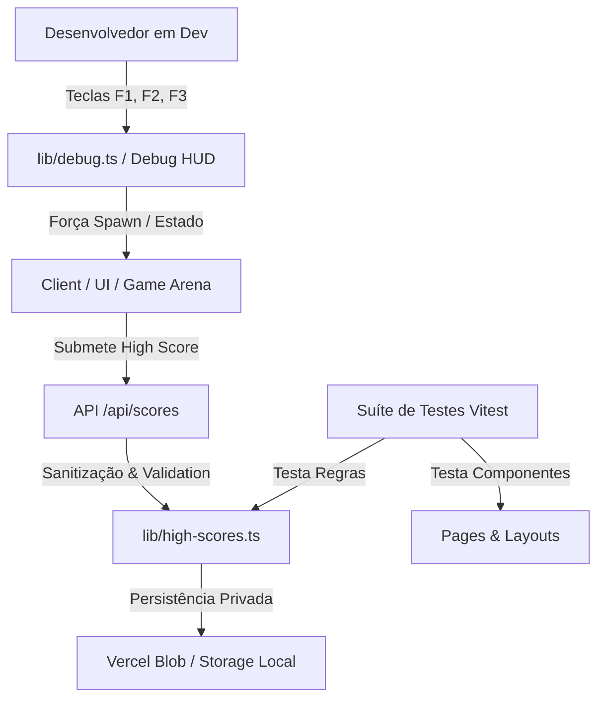
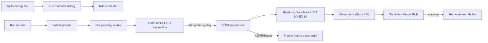

# Arquitetura e Design: Fase 2 — Estabilidade e Qualidade (ESTAB)

**Spec**: [`_docs/specs/features/estabilidade-qualidade/spec.md`](file:///Volumes/SSD_Externo/repo_personal/java-pleno-pixel-hunt/_docs/specs/features/estabilidade-qualidade/spec.md)
**Status**: Draft

---

## Visão Geral de Arquitetura

O design técnico da Fase 2 visa estabilizar o build, introduzir uma suíte de testes unitários com **Vitest + React Testing Library**, implementar um mecanismo de **Debug/DevTools** em desenvolvimento e proteger os endpoints da API contra estouro de exceção ou spam.



---

## Análise de Reuso de Código

### Componentes e Módulos Existentes

| Módulo / Arquivo | Localização | Como Utilizar |
| --- | --- | --- |
| `lib/high-scores.ts` | [`lib/high-scores.ts`](file:///Volumes/SSD_Externo/repo_personal/java-pleno-pixel-hunt/lib/high-scores.ts) | Estender com tratamento gracioso quando `BLOB_READ_WRITE_TOKEN` não estiver definido. |
| `lib/adsense.ts` | [`lib/adsense.ts`](file:///Volumes/SSD_Externo/repo_personal/java-pleno-pixel-hunt/lib/adsense.ts) | Ajustar fallback hardcoded para não carregar publisher desnecessariamente. |
| `app/page.tsx` | [`app/page.tsx`](file:///Volumes/SSD_Externo/repo_personal/java-pleno-pixel-hunt/app/page.tsx) | Interceptar eventos de teclado (`F1`/`F2`/`F3`) para acionar o modo Debug em ambiente dev. |
| `app/globals.css` | [`app/globals.css`](file:///Volumes/SSD_Externo/repo_personal/java-pleno-pixel-hunt/app/globals.css) | Refatorar `.legal-shell` de `height: 100dvh` para `min-height: 100dvh`. |

---

## Componentes e Interfaces

### 1. Suíte de Testes Unitários (`vitest.config.ts`)

- **Propósito**: Executar testes de componentes React e funções utilitárias puras.
- **Localização**: `vitest.config.ts`, `lib/__tests__/high-scores.test.ts`, `app/__tests__/pages.test.tsx`
- **Dependências**: `@testing-library/react`, `vitest`, `jsdom`

### 2. Módulo de Debug do Jogo (`lib/debug.ts`)

- **Propósito**: Fornecer atalhos de depuração em desenvolvimento para acionar boss, zerar estamina, conceder power-ups ou ir direto para a vitória.
- **Localização**: [`lib/debug.ts`](file:///Volumes/SSD_Externo/repo_personal/java-pleno-pixel-hunt/lib/debug.ts)
- **Interface**:
  - `isDebugAllowed(): boolean`
  - `triggerDebugAction(action: 'spawn_boss' | 'add_powerup' | 'win_game' | 'reset'): void`

### 3. Proteção e Throttling na API (`app/api/scores/route.ts`)

- **Propósito**: Sanitizar a entrada e aplicar limitação simples de taxa de submissão por IP ou token.
- **Localização**: [`app/api/scores/route.ts`](file:///Volumes/SSD_Externo/repo_personal/java-pleno-pixel-hunt/app/api/scores/route.ts)
- **Estratégia de Erro**: Se `BLOB_READ_WRITE_TOKEN` estiver ausente na Vercel, a API responde `{ scores: [], storage: 'local' }` ao invés de lançar `Error 503`.

---

## Estratégia de Tratamento de Erros

| Cenário de Erro | Tratamento Técnico | Impacto no Usuário |
| --- | --- | --- |
| Vercel Blob indisponível/sem token | API degrada suavemente retornando status 200 com array local ou fallback. | Jogo guarda a pontuação no `localStorage` sem travar a interface. |
| Erro de compilação Turbopack no build | Configuração explicita de fallback para SWC/Vite em `next.config.ts`. | Build contínuo e sem falhas em ambientes CI/CD. |
| Envio massivo de scores via POST | Header de cache + filtro de timestamp simples. | Evita spam no ranking e uso excessivo de cota no Vercel Blob. |

---

## Riscos e Preocupações (Risks & Concerns)

| Preocupação | Localização | Impacto | Mitigação |
| --- | --- | --- | --- |
| Componente monolítico grande | [`app/page.tsx:1-1800`](file:///Volumes/SSD_Externo/repo_personal/java-pleno-pixel-hunt/app/page.tsx#L1-L1800) | Dificuldade para isolar estados e testar partes da UI. | Extrair atalhos de teclado e estado de debug em módulo desacoplado (`lib/debug.ts`). |
| Incompatibilidade de tipos Vitest + Next.js | `tsconfig.json` | Conflito de definições globais entre Jest/Vitest. | Configurar `tsconfig.json` com `types: ["node", "vitest/globals"]`. |

---

## Decisões Técnicas

| Decisão | Escolha | Justificativa |
| --- | --- | --- |
| Framework de Testes | Vitest | Execução ultra-rápida nativa com ESM e TypeScript no Next.js. |
| Ativação do Modo Debug | Apenas `NODE_ENV === 'development'` ou `?debug=1` | Impede uso indevido de cheats por jogadores em ambiente de produção. |

---

## Emenda de Design — Ciclo Interno 1

**Contexto:** `_docs/specs/features/estabilidade-qualidade/context.md`
**Status:** Approved para decomposição em tasks

Esta emenda substitui, apenas para o ciclo interno 1, as decisões anteriores de ativação por query flag, throttle em `Map` e mistura entre ranking local e pendências. O histórico acima permanece como registro do design original.

### Knowledge Verification Chain

| Etapa | Evidência consultada | Conclusão |
| --- | --- | --- |
| Codebase | `app/api/scores/route.ts`, `app/page.tsx`, `lib/debug.ts`, testes atuais e `package.json` | O throttle usa `Map` por processo; ranking e pendências compartilham `java-pleno-pixel-hunt-high-scores`; não existe Playwright nem provider LCOV instalado. |
| Docs do projeto | `README.md`, `AGENTS.md`, `sonar-project.properties`, Next.js 16 local `route-handlers.md` e `STATE.md` | A rota usa Web `Request`/`Response`, o deploy é Vercel, Blob persiste ranking e Sonar já aponta `coverage/lcov.info`. Nenhuma AD ativa impõe tecnologia de rate limit. |
| Context7 | Upstash Redis docs, integração Vercel e SDK TypeScript | `@upstash/redis` é REST-based e adequado a serverless; `Redis.fromEnv()` usa `UPSTASH_REDIS_REST_URL`/`UPSTASH_REDIS_REST_TOKEN`; `redis.set(key, value, { nx: true, ex: 10 })` fornece aquisição atômica com expiração. |

### Decisão tecnológica pesquisada

| Item | Escolha | Contrato verificado |
| --- | --- | --- |
| Dependência | `@upstash/redis` | SDK REST para funções serverless/edge; adicionar como dependency de runtime. |
| Inicialização | `Redis.fromEnv()` | Documentado pelo SDK para carregar credenciais do ambiente. |
| Variáveis obrigatórias | `UPSTASH_REDIS_REST_URL`, `UPSTASH_REDIS_REST_TOKEN` | Configuradas server-side na integração Upstash/Vercel; nunca expostas com prefixo `NEXT_PUBLIC_`. |
| Aquisição do throttle | `redis.set(rateKey, "1", { nx: true, ex: 10 })` | Uma única operação Redis: valor truthy permite; retorno falsy indica janela já adquirida. A tentativa bloqueada não regrava nem renova a chave. |
| Fallback produção | Fail-closed | Credencial ausente, erro ou timeout Redis retorna `503`; `addHighScore` não é chamado e o cliente conserva a fila. |
| Fallback development/test | Store em memória injetável | Mantém o contrato de 10 segundos para execução local, mas deve ser identificado como `local-memory` e nunca usado em produção. |

Não foi encontrada documentação Context7 que defina um comportamento automático de fallback do SDK em falha. Por isso o fallback é responsabilidade explícita da aplicação, sem atribuir ao SDK uma API ou garantia não documentada.

### Arquitetura



O endpoint continua sendo um Route Handler Node/Next.js e preserva `addHighScore`, `readHighScores`, `sanitizeScore` e `cleanScores`. O Redis coordena somente throttle e idempotência; Vercel Blob continua sendo a fonte do ranking global.

### Componentes e interfaces

#### Guardas de debug

- **Localização:** `lib/debug.ts`, integração em `app/page.tsx`.
- **Interfaces:**
  - `isDebugAllowed(): boolean` — `true` somente em development.
  - `isDebugAction(value: unknown): value is DebugAction` — valida payload pela allowlist canônica.
  - `triggerDebugAction(action: DebugAction): void` — não despacha fora de development.
- **Listener:** reexecuta as duas guardas antes de alterar estado. A primeira ação aplicada marca `runOriginRef` como `debug`; `start()`/reset de nova run restaura `normal`.
- **Ranking:** o fluxo de salvar encerra antes de POST/enqueue quando `runOriginRef === "debug"`; a rota rejeita payload com marcador debug como defesa contratual adicional.

#### RateLimitStore

- **Localização proposta:** `lib/score-rate-limit.ts`.
- **Interfaces:**
  - `acquire(ip: string): Promise<{ allowed: boolean; retryAfterMs: number; backend: "redis" | "local-memory" }>`.
  - `hashRateLimitIdentifier(ip: string): string` — deriva chave estável sem persistir IP em claro.
- **Implementação produção:** instancia `Redis.fromEnv()` somente no servidor e usa `SET NX EX 10` na chave `score:rate:<sha256-ip>`.
- **Implementação local:** store injetável por teste; relógio controlável e TTL equivalente.
- **Observabilidade:** registra backend e classe do erro, sem IP/chave completa/payload.

#### IdempotencyStore

- **Localização proposta:** `lib/score-idempotency.ts` ou co-localizado ao rate store se permanecer um único adaptador Redis.
- **Interfaces:**
  - `claim(submissionId: string): Promise<"claimed" | "completed" | "in-flight">`.
  - `complete(submissionId: string): Promise<void>` — mantém marcador concluído por 24 horas.
  - `release(submissionId: string): Promise<void>` — libera claim não concluído após falha de persistência.
- **Ordenação:** throttle → claim idempotente → sanitização/persistência → complete. Duplicata `completed` retorna sucesso sem novo Blob write; `in-flight` retorna resposta transitória sem duplicar.
- **Pesquisa adicional de implementação:** antes de codificar `claim/complete/release`, confirmar no Context7 os comandos condicionais exatos do SDK; este design não inventa chamada para o contrato abstrato.

#### PendingScoreQueue

- **Localização:** helpers co-localizados em `app/page.tsx`; não extrair toda a sincronização de `Home` neste ciclo, preservando a questão categoria (c).
- **Storage key:** `java-pleno-pixel-hunt-pending-scores`.
- **Interfaces:**
  - `loadPendingScores(): PendingScoreEntry[]` — valida versão e campos; descarta somente entradas estruturalmente inválidas.
  - `enqueuePendingScore(entry): void` — dedupe por `submissionId`.
  - `updatePendingScoreAttempt(submissionId, attemptedAt): void`.
  - `removePendingScore(submissionId): void` — somente após sucesso persistido/idempotente.
  - `drainPendingScores(trigger: "load" | "online"): Promise<void>` — mutex lógico, FIFO e um POST em voo.
- **Timer:** calcula o início do próximo POST a partir do início anterior e aguarda o restante de 10 segundos; nenhuma espera ocorre depois que a fila esvazia.

#### Contrato da API e qualidade

- `GET /api/scores` passa cada entrada por `sanitizeScore` e o conjunto por `cleanScores` antes de responder.
- `POST /api/scores` mantém sanitização antes da persistência, recebe `Idempotency-Key` e rejeita payload debug.
- O painel usa `<dialog open>` com nome acessível e `onClose`; o componente continua condicional para não deixar diálogo invisível montado.
- Playwright adiciona configuração mobile e um spec para `/privacidade` e `/sobre`, verificando estilo computado, scroll e último elemento focável.
- LCOV usa provider Vitest compatível e de mesma versão da instalação (`@vitest/coverage-v8`), reporter `lcov` e script `test:coverage`; `sonar-project.properties` já aponta para `coverage/lcov.info`.

### Modelos de dados

```typescript
type RunOrigin = "normal" | "debug";

interface PendingScoreEntry {
  version: 1;
  submissionId: string;
  score: HighScore;
  enqueuedAt: string;
  attempts: number;
  lastAttemptAt: string | null;
}

interface RateLimitDecision {
  allowed: boolean;
  retryAfterMs: 10_000;
  backend: "redis" | "local-memory";
}

type IdempotencyClaim = "claimed" | "completed" | "in-flight";
```

`submissionId` é criado uma única vez no ato da submissão própria e permanece estável. A fila é FIFO por `enqueuedAt`; empate preserva a ordem do array armazenado. O header `Idempotency-Key` deve ser idêntico ao `submissionId`.

### Tratamento de erros

| Cenário | Resposta/estado | Continuação |
| --- | --- | --- |
| Debug em produção, query ou evento forjado | Ignorar sem side effect | Run/ranking permanecem normais. |
| Payload debug no POST | `400` ou `403` contratual, sem persistência | Não entra em fila como score elegível. |
| Redis ausente/indisponível em produção | `503`, sem Blob write | Cliente mantém item e encerra drain. |
| Janela Redis já adquirida | `429`, `Retry-After: 10`, payload exato da spec | Cliente mantém item e encerra drain. |
| Idempotência concluída | Sucesso idempotente, sem novo Blob write | Cliente remove item correspondente. |
| Claim em voo | Resposta transitória, sem persistência duplicada | Cliente mantém item. |
| Blob falha depois do claim | Release do claim; resposta não persistida | Cliente mantém item para retry. |
| Fila local corrompida parcialmente | Manter entradas válidas; ignorar inválidas | Registrar quantidade, nunca payload. |
| Novo `online` durante drain | Reusar promise/mutex existente | Nenhum POST/timer adicional. |

### Riscos e preocupações

| Preocupação | Localização | Impacto | Mitigação |
| --- | --- | --- | --- |
| Listener aceita `CustomEvent` sem revalidar ambiente/payload | `app/page.tsx` / `lib/debug.ts` | Cheats e estado inválido | Guardas no dispatcher e no consumidor; testes de produção e payload inválido. |
| Entidade boss não é observável pelos testes | `app/page.tsx` / `game-debug.test.tsx` | Mutante de spawn sobrevive | Expor estado derivado da entidade no HUD debug e exigir `hp === maxHp`. |
| `Map` por processo não coordena Vercel | `app/api/scores/route.ts` | Rate limit contornável | Redis compartilhado com aquisição atômica e TTL. |
| Redis vira dependência crítica do POST | `app/api/scores/route.ts` | Indisponibilidade temporária bloqueia ranking | Fail-closed + fila cliente; logs sem dados sensíveis. |
| Claim idempotente e Blob não formam transação única | adapter Redis + `lib/high-scores.ts` | Janela curta de estado inconsistente | Estados claimed/completed, release em erro e TTL curto de claim; testes de falha entre etapas. |
| Ranking local mistura dados globais e próprios | `app/page.tsx` | Reenvio de scores de terceiros | Chave e modelo separados; GET nunca enfileira. |
| Timers load/online podem competir | `app/page.tsx` | Rajada e duplicação | Mutex/promise ref e um POST em voo. |
| Playwright não está configurado | raiz / `e2e` | Gap mobile sem evidência | Dependência/config/spec mobile co-localizados em task própria. |
| Sonar espera LCOV inexistente | `sonar-project.properties` | Quality Gate em 0% | Provider Vitest compatível e reporter LCOV; bloquear task se compatibilidade não se confirmar. |

### Rastreabilidade do design

| Requirement | Componentes |
| --- | --- |
| `ESTAB-06`, `ESTAB-07` | Guardas de debug, listener, `RunOrigin`, fluxo de ranking |
| `ESTAB-08` | `RateLimitStore`, rota POST, Redis |
| `ESTAB-09`, `ESTAB-10` | `PendingScoreQueue`, `IdempotencyStore`, drain load/online |
| `ESTAB-11` | HUD debug observável e testes da arena |
| `ESTAB-12` | GET/POST, `sanitizeScore`, `cleanScores` |
| `ESTAB-13` | Playwright mobile |
| `ESTAB-14` | `<dialog>` e Sonar S6819 |
| `ESTAB-15` | Vitest coverage-v8, LCOV e Sonar |

### Decisões técnicas do ciclo 1

| Decisão | Escolha | Justificativa |
| --- | --- | --- |
| Backend compartilhado | Upstash Redis via `@upstash/redis` | Compatível com Vercel serverless e operação `SET NX EX` documentada. |
| Falha de rate limit | Fail-closed em produção | A garantia distribuída não pode degradar silenciosamente para best-effort. |
| Fila | Chave própria + `submissionId` estável | Separa ownership e permite retry idempotente. |
| Orquestração | FIFO, mutex e 10 segundos entre inícios | Respeita rate limit sem concorrência entre load/online. |

Essas escolhas são locais à feature de ranking/estabilidade. Nenhuma nova AD projeto-level é necessária; `STATE.md` e seu Handoff permanecem inalterados.
