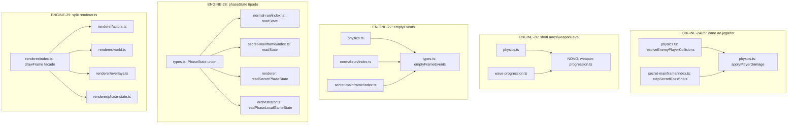

# Motor de Jogo Modular — Fix2 Design

**Spec**: `_docs/specs/features/motor-de-jogo-modular-fix2/spec.md`
**Status**: Approved

---

## Architecture Overview

Fix2 não introduz nenhuma abstração nova (nenhuma Phase, nenhum conceito de domínio) — é consolidação estrutural dentro do motor já existente (`lib/pixel-hunt-engine/`), seguindo o mesmo padrão incremental já usado com sucesso em `physics.ts` (T14-T19, fix1) e `geometry.ts` (fix1, ENGINE-20). Cinco mudanças independentes, cada uma isolada a um subconjunto de arquivos:



Ordem de implementação recomendada (menor para maior risco/esforço, cada item é independente e commitável isoladamente): **ENGINE-27 → ENGINE-24/25 → ENGINE-26 → ENGINE-28 → ENGINE-29**.

---

## Code Reuse Analysis

### Existing Components to Leverage

| Component | Location | How to Use |
| --- | --- | --- |
| `geometry.ts` (padrão de módulo-kernel compartilhado) | `lib/pixel-hunt-engine/geometry.ts` | Mesmo padrão (função pura, zero dependências do motor, importada por `physics.ts` e Phases) aplicado ao novo `weapon-progression.ts` (ENGINE-26). |
| `EnginePhase.id: "normal-run" \| "secret-mainframe"` | `lib/pixel-hunt-engine/phases/phase.ts:16` | Reusado como o literal-union discriminante de `PhaseState` (ENGINE-28) — evita inventar um novo vocabulário de "tipo de fase". |
| `burst`/`distance` (já deduplicados no fix1) | `lib/pixel-hunt-engine/geometry.ts` | `applyPlayerDamage` (ENGINE-24) reusa `burst()` diretamente, sem reimplementar. |
| Extração incremental sem mudar API pública (padrão de `stepWorld`, T14-T19) | `lib/pixel-hunt-engine/physics.ts` | Mesmo padrão aplicado ao split de `renderer.ts` (ENGINE-29): função pública (`drawFrame`) mantém assinatura, internals viram sub-funções/submódulos. |

### Integration Points

| System | Integration Method |
| --- | --- |
| `phases/normal-run/index.ts`, `phases/secret-mainframe/index.ts` | Consomem `drawFrame`/`ViewState` de `@/lib/pixel-hunt-engine/renderer` — path de import **não muda** (vira barrel `renderer/index.ts`). |
| `orchestrator.ts` | Consome `readPhaseLocalGameState` (interno) e o tipo `EngineWorld.phaseState` — atualizado para o novo union type, sem mudança de assinatura pública do `Engine`. |
| Testes existentes (`__tests__/*.test.ts`, 421 hoje) | Nenhum teste importa símbolos internos renomeados/movidos (confirmado via grep abaixo) — apenas testes novos são adicionados, nenhum existente precisa mudar de import. |

---

## Components

### `applyPlayerDamage` (ENGINE-24/25)

- **Purpose**: Única implementação da regra "jogador leva dano" (invencibilidade, flash, shake, som, partículas, evento), parametrizada por quantidade de dano e contagem de partículas.
- **Location**: `lib/pixel-hunt-engine/physics.ts` (não-exportada — mesmo padrão de `resolveEnemyDeath`/`resolveShotHitOnEnemy`, funções internas extraídas do próprio arquivo em T18/T19). `secret-mainframe/index.ts` importa a versão exportada.
- **Interfaces**:
  - `applyPlayerDamage(world: EngineWorld, audio: AudioEngine, events: FrameEvents, damage: number, burstCount: number): void` — aplica o dano se `player.invincible <= 0` (guarda movida para dentro da função, já que os 2 chamadores fazem a mesma checagem hoje); idempotente-nula se o jogador já está invencível.
- **Dependencies**: `burst`/`distance` de `geometry.ts` (já importado por ambos os arquivos hoje).
- **Reuses**: `ENEMY_TOUCH_DAMAGE` continua definida só em `physics.ts` (não faz parte da função compartilhada — cada chamador já resolve o `damage` antes de chamar).

**Chamadores após a mudança**:
- `physics.ts:resolveEnemyPlayerCollisions`: `applyPlayerDamage(world, audio, events, ENEMY_TOUCH_DAMAGE[enemy.kind], 16)`.
- `secret-mainframe/index.ts:stepSecretBossShots`: `applyPlayerDamage(world, ctx.audio, events, 10, 12)` — precisa exportar `applyPlayerDamage` de `physics.ts` (já é o padrão: `secret-mainframe/index.ts` já importa várias funções de `physics.ts` hoje, ex. `scaledEnemyHp` via `wave-progression.ts`).

### `weapon-progression.ts` (ENGINE-26) — NOVO módulo

- **Purpose**: Fonte única de `shotLanesForWeaponLevel`/`weaponLevelForWave`, quebrando o ciclo de import que impediria `physics.ts` de importar de `wave-progression.ts` (que já importa `scaledEnemyHp` de `physics.ts`).
- **Location**: `lib/pixel-hunt-engine/weapon-progression.ts` (raiz do motor, mesmo nível de `geometry.ts`/`audio.ts` — módulo-kernel sem dependência de nenhuma Phase nem de `physics.ts`).
- **Interfaces**:
  - `shotLanesForWeaponLevel(weaponLevel: number): number[]`
  - `weaponLevelForWave(wave: number): number`
- **Dependencies**: nenhuma (funções puras, só `number` in/out).
- **Reuses**: nenhum — extração literal do corpo já idêntico nas duas cópias hoje.

`physics.ts` e `phases/normal-run/wave-progression.ts` passam a importar de `weapon-progression.ts`; `wave-progression.ts` mantém seu import de `scaledEnemyHp` de `physics.ts` inalterado (sem ciclo, já que `weapon-progression.ts` não importa nada do motor).

### `emptyFrameEvents` (ENGINE-27)

- **Purpose**: Única fábrica de `FrameEvents` vazio.
- **Location**: `lib/pixel-hunt-engine/types.ts`, logo após a definição de `FrameEvents`.
- **Interfaces**:
  - `emptyFrameEvents(): FrameEvents`
- **Dependencies**: nenhuma.
- **Reuses**: nenhum — mesmo shape hoje triplicado.

`physics.ts`, `phases/normal-run/index.ts` e `phases/secret-mainframe/index.ts` importam de `types.ts` e removem a função local `emptyEvents()`. Chamada nos 3 sites vira `emptyFrameEvents()` (ou mantém o nome local `emptyEvents` como alias de import, se preferível para minimizar o diff — decisão de Tasks, não estrutural).

### `PhaseState` (union discriminada) (ENGINE-28)

- **Purpose**: Substituir `EngineWorld.phaseState: unknown` por um tipo com discriminante explícito, eliminando o duck-typing em runtime nos **4 pontos de leitura** encontrados (o spec citava 2; a pesquisa de Design encontrou mais 2 — ver Risks & Concerns).
- **Location**: `lib/pixel-hunt-engine/types.ts`.
- **Interfaces**:
  ```typescript
  export type NormalRunPhaseState = {
    phase: "normal-run";
    localGameState: "playing" | "choice" | "over" | "won" | "promotion";
  };

  export type SecretMainframePhaseState = {
    phase: "secret-mainframe";
    localGameState: "playing" | "over" | "won";
    secretBossShots: SecretBossShot[];
    meetingZones: MeetingZone[];
    cobolSnake: CobolSnake;
    datacenterMoss: Array<{ x: number; y: number; r: number }>;
    datacenterCracks: Array<Array<{ x: number; y: number }>>;
  };

  export type PhaseState = NormalRunPhaseState | SecretMainframePhaseState;
  ```
  `EngineWorld.phaseState: PhaseState | null` (substitui `unknown`).
- **Dependencies**: `SecretBossShot`/`MeetingZone`/`CobolSnake` já existem em `types.ts` (não é uma dependência nova — hoje `SecretMainframePhaseState` já usa esses mesmos tipos, só que declarada em `renderer.ts`).
- **Reuses**: o literal `"normal-run" | "secret-mainframe"` já existe em `EnginePhase.id` (`phase.ts:16`) — o campo `phase` do union reusa exatamente esse vocabulário (não um novo).

**Migração dos 4 call sites**:
1. `phases/normal-run/index.ts:readState()` — troca `existing as NormalRunPhaseState | null` + `"localGameState" in existing` por `world.phaseState?.phase === "normal-run" ? world.phaseState : <fresh>`. `NormalRunPhaseState` local (hoje privada nesse arquivo) é removida; o arquivo importa de `types.ts`.
2. `phases/secret-mainframe/index.ts:readState()` — mesmo padrão, discriminante `"secret-mainframe"`. `SecretRunState` (tipo local hoje) vira só um alias/import de `SecretMainframePhaseState` de `types.ts` — remove a definição duplicada que hoje existe em `renderer.ts`.
3. `renderer.ts` (futuro `renderer/phase-state.ts`, ver ENGINE-29) — `readSecretPhaseState()` troca a checagem `!state.cobolSnake || !state.meetingZones || !state.secretBossShots` por `world.phaseState?.phase === "secret-mainframe" ? world.phaseState : null`. A definição local de `SecretMainframePhaseState` em `renderer.ts` é **removida** — o tipo passa a ser importado de `types.ts` (mudança de direção de dependência: hoje `secret-mainframe/index.ts` importa o tipo de `renderer.ts`; depois disso, ambos importam de `types.ts`, a fonte comum).
4. `orchestrator.ts:readPhaseLocalGameState()` — troca `(world.phaseState as { localGameState?: unknown } | null)?.localGameState` por `world.phaseState?.localGameState ?? null` (acesso direto, sem cast — `localGameState` existe nos dois membros do union, TypeScript permite o acesso sem narrowing porque o campo é comum aos dois braços).

### Split de `renderer.ts` (ENGINE-29)

- **Purpose**: Dividir as 12 funções `draw*` + a lógica inline de `drawFrame` por área coesa, resolvendo a duplicação interna de 35.7% (SonarQube, fix1).
- **Location**: `lib/pixel-hunt-engine/renderer.ts` vira diretório `lib/pixel-hunt-engine/renderer/`:
  - `renderer/index.ts` — `drawFrame` (fachada pública, única exportação usada fora do diretório) + orquestração do frame (save/translate/restore, ordem de desenho, banners de `damageFlash`/`bossBanner`/`effectBanner`, dispatch final por `gameState`).
  - `renderer/actors.ts` — `drawActor`, `drawMainframeBoss`, `drawPlayer`, `drawObstacle`, `drawPowerUp` (tudo que desenha uma entidade individual do mundo).
  - `renderer/world.ts` — `drawGrid`, `drawDatacenterFloor`, `drawFinalChoiceScene`, e o bloco hoje inline em `drawFrame` para meeting zones/cobol snake trail (linhas 567-607 atuais) — é exatamente esse bloco inline vs. `drawDatacenterFloor` que o SonarQube provavelmente está contando como duplicação interna (mesmo padrão `pixelRect`/`ctx.arc`/`ctx.fillText` repetido).
  - `renderer/overlays.ts` — `drawDim`, `drawOverlay`, `drawVictoryOverlay`.
  - `renderer/phase-state.ts` — `readSecretPhaseState` (atualizado para ENGINE-28) + re-export de `ViewState`.
- **Interfaces**: `export function drawFrame(ctx: CanvasRenderingContext2D, world: EngineWorld, view: ViewState): void` — assinatura idêntica à atual, único símbolo importado por `phases/normal-run/index.ts` e `phases/secret-mainframe/index.ts` (path `@/lib/pixel-hunt-engine/renderer` não muda, resolve para `renderer/index.ts`). `ViewState` e `SecretMainframePhaseState` continuam exportados do mesmo path público (`renderer/index.ts` re-exporta de `phase-state.ts`, ou os consumidores passam a importar `SecretMainframePhaseState` de `types.ts` diretamente — ver nota ENGINE-28 acima).
- **Dependencies**: `character-sprite.ts`, `geometry.ts`, `final-choice.ts` (mesmas de hoje, redistribuídas por submódulo conforme quem usa o quê).
- **Reuses**: nenhuma lógica de desenho muda — só localização/agrupamento.

---

## Data Models

### `PhaseState` (ver Components acima para o shape completo)

**Relationships**: `EngineWorld.phaseState: PhaseState | null` (hoje `unknown`). `PhaseState` é a união de `NormalRunPhaseState` e `SecretMainframePhaseState`, discriminada pelo campo `phase`, que reusa o literal já existente em `EnginePhase.id`.

### `applyPlayerDamage` — parâmetros (não é um model persistente, mas fixa o contrato)

```typescript
function applyPlayerDamage(
  world: EngineWorld,
  audio: AudioEngine,
  events: FrameEvents,
  damage: number,
  burstCount: number,
): void
```

**Relationships**: muta `world.player.hp`/`world.player.invincible`/`world.run.damageFlash`/`world.run.shake`, seta `events.playerHit = true`, chama `audio.playSound("hurt")` e `burst(world, ...)` — mesmos efeitos colaterais que já existem hoje espalhados em 2 lugares, sem nenhum efeito colateral novo.

---

## Error Handling Strategy

N/A para esta rodada — nenhuma das 5 mudanças introduz um novo caminho de erro/exceção. O crash boundary existente (`orchestrator.ts:handleActivePhaseCrash`, ENGINE-12/19/23) já cobre qualquer exceção que viesse a surgir de `update()`/`draw()`, incluindo os pontos tocados aqui — nenhuma mudança necessária nesse mecanismo.

| Error Scenario | Handling | User Impact |
| --- | --- | --- |
| `world.phaseState` é `null` num call site que espera `PhaseState` (ex.: `readState()` chamado antes de `enter()`) | Idêntico ao comportamento defensivo já existente hoje (fallback para estado fresco) — só o tipo do fallback muda, não a lógica. | Nenhum — mesmo comportamento de hoje. |

---

## Risks & Concerns

| Concern | Location (file:line) | Impact | Mitigation |
| --- | --- | --- | --- |
| `EngineWorld.phaseState` é lido em **4 pontos**, não 2 como o spec assumiu inicialmente (`renderer.ts:51` e `orchestrator.ts:171` também fazem duck-typing próprio, além dos 2 `readState()` das Phases) | `renderer.ts:50-53`, `orchestrator.ts:171` | Se ENGINE-28 tipasse só os 2 `readState()` citados no spec, os outros 2 sites continuariam com cast `unknown`/duck-typing — a meta "substituir `unknown`" (AC1) ficaria incompleta. | Design cobre os 4 sites explicitamente (ver Components → `PhaseState`, item "Migração dos 4 call sites"). Não é mudança de escopo do requisito, é a implementação completa do que ENGINE-28 já pedia. |
| `SecretMainframePhaseState` está definida hoje em `renderer.ts`, não em `types.ts` — `secret-mainframe/index.ts` importa esse tipo de `renderer.ts` (direção de dependência Phase → renderer) | `renderer.ts:42-48`, `phases/secret-mainframe/index.ts:14,106` | Mover o tipo para `types.ts` inverte essa direção pontual (renderer passa a importar de `types.ts`, não o contrário) — mudança de import em 2 arquivos, sem risco de ciclo (`types.ts` não importa de `renderer.ts` nem de nenhuma Phase). | Migração explícita nesta rodada (ENGINE-28), tratada como parte do requisito, não como scope creep — é a mesma dedupe de tipo que a AC já pede (fonte única). |
| Adicionar um novo Phase no futuro exigirá editar `types.ts` (novo membro do union `PhaseState`), algo que hoje não é necessário com `phaseState: unknown` | `types.ts` (novo) | Reduz marginalmente a independência de Phase citada no design original (`design.md` da feature-mãe, princípio "motor genérico não conhece a forma real") — trade-off consciente: `EnginePhase.id` já é um literal-union de 2 membros hardcoded em `phase.ts`, então adicionar uma 3ª Phase já exigiria editar esse arquivo hoje; estender `PhaseState` no mesmo commit é o mesmo tamanho de mudança, não uma categoria nova de acoplamento. | Documentado aqui como decisão consciente (ver Tech Decisions) — não é um defeito, é o trade-off que a Story 4 do spec pediu (segurança de tipo em troca de um ponto a mais de extensão por Phase nova). |
| `renderer.ts:567-607` (bloco inline de meeting zones/cobol snake dentro de `drawFrame`) provavelmente é a origem real dos 35.7% de duplicação (padrões `pixelRect`/`ctx.arc`/`ctx.fillText` repetidos entre esse bloco e `drawDatacenterFloor`) | `renderer.ts:441-478`, `renderer.ts:567-607` | Se o split de ENGINE-29 só mover funções para arquivos diferentes sem também extrair esse bloco inline para uma função nomeada em `world.ts`, a duplicação percentual pode não cair o suficiente para bater a meta de <15% do AC3. | Design já especifica que esse bloco inline vira parte de `renderer/world.ts` como função nomeada (não fica inline em `drawFrame`) — ver Components → Split de `renderer.ts`. |

> Nenhum risco de segurança, performance ou cobertura de teste identificado — todas as 5 mudanças são extrações/renomeações sem novo comportamento, exceto a correção pontual e já assumida de `events.playerHit` (ENGINE-25).

---

## Tech Decisions (only non-obvious ones)

| Decision | Choice | Rationale |
| --- | --- | --- |
| Direção do dedupe de `shotLanesForWeaponLevel`/`weaponLevelForWave` | Novo módulo neutro `weapon-progression.ts` (não mover para `wave-progression.ts` nem manter em `physics.ts`) | Evita o ciclo de import (`wave-progression.ts` → `physics.ts` já existe via `scaledEnemyHp`); segue o mesmo padrão já validado de `geometry.ts` (módulo-kernel sem dependência de Phase nem de `physics.ts`). |
| `PhaseState` como união discriminada em `types.ts` (Option A) em vez de manter `unknown` com apenas um tipo-guard local por Phase (Option B/C, mais conservador) | Union discriminada completa | A spec (ENGINE-28, AC1) já pede literalmente "união discriminada dos estados já existentes" — Option A é a implementação direta disso. O custo (types.ts passa a conhecer as 2 formas de Phase) é pequeno porque `phase.ts` já hardcoda os 2 ids; não é um acoplamento de categoria nova, só reusa o vocabulário existente. Documentado como trade-off consciente em Risks & Concerns. |
| `SecretMainframePhaseState` migra de `renderer.ts` para `types.ts` | Migrar | Consequência direta da decisão acima — não dá pra ter uma união discriminada em `types.ts` referenciando um tipo definido em `renderer.ts` (isso criaria a direção de dependência errada: `types.ts`, o kernel, dependendo de um arquivo-folha). |
| Guard de `player.invincible <= 0` movido para dentro de `applyPlayerDamage` | Sim, movido | Hoje os 2 chamadores fazem essa checagem antes de chamar o bloco de dano — colocar a guarda dentro da função compartilhada a torna uma "aplicação de dano segura" completa (chamar 2x no mesmo frame não duplica o efeito), reduzindo a chance de um chamador futuro esquecer a checagem. |
| Local de `emptyFrameEvents()` | `types.ts`, ao lado de `FrameEvents` | Já decidido na Specify (ver `spec.md` Assumptions) — confirmado aqui sem mudança. |

> Nenhuma dessas decisões estabelece uma convenção de projeto que outras features precisem seguir (são internas ao motor) — nenhuma nova entrada em `STATE.md` `## Decisões` é necessária. `AD-010` (motor extraído para `lib/pixel-hunt-engine/`, Phases sem depender de React) continua a única decisão ativa relevante, e este design está em conformidade com ela (nenhuma mudança introduz dependência de React no motor).

---

## Confirmed Lessons Applied

Nenhuma lição confirmada existe ainda no projeto (`python3 .agents/skills/tlc-spec-driven/scripts/lessons.py list --status confirmed` retornou vazio) — nada a aplicar.
