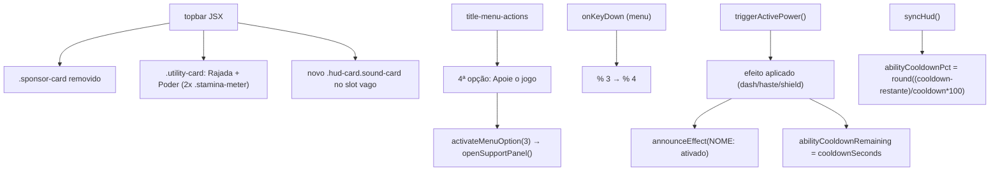

# Reorganização do HUD e Feedback do Poder Especial Design

**Spec**: `_docs/specs/features/reorganizacao-hud-e-poder/spec.md`
**Status**: Draft

---

## Architecture Overview

Escopo é inteiramente dentro de `app/page.tsx` (JSX do `topbar` + motor do jogo) e `app/globals.css` — nenhum módulo novo, nenhuma mudança em `lib/`. Três mudanças independentes que só coincidem no mesmo arquivo:

1. **Layout do HUD**: `.sponsor-card` sai do JSX; `.sound-controls` migra pra esse slot (vira seu próprio `.hud-card`); `.utility-card` ganha um segundo medidor (cooldown do poder) ao lado da Rajada, reaproveitando a MESMA classe CSS `.stamina-meter` (zero CSS novo pro medidor em si — "mesmo tamanho" fica garantido por construção, não por coincidência de valores).
2. **Menu de título**: 4ª opção "Apoie o jogo"; navegação por teclado generalizada de `% 3` para `% 4`.
3. **Feedback do poder**: `triggerActivePower()` ganha uma chamada a `announceEffect()` (a mesma função já usada pelos power-ups) e uma nova state `abilityCooldownPct` (produção, não debug) calculada em `syncHud()` do mesmo jeito que `burstStaminaPct` já é.

---

## Code Reuse Analysis

### Existing Components to Leverage

| Component | Location | How to Use |
| --- | --- | --- |
| `.stamina-meter` (CSS + JSX shape: `strong`/`i` com `--stamina`/`small`) | `app/page.tsx` (Rajada), `app/globals.css:285-311` | Reaproveitado literalmente pro medidor do poder — mesma classe, outro rótulo ("Poder") e outra variável de progresso. Garante "mesmo tamanho" sem escrever CSS novo. |
| `announceEffect(message)` | `app/page.tsx:973-976` | Chamado direto de dentro de `triggerActivePower()`, mesma função que já desenha o banner central no canvas para os power-ups. |
| `burstStaminaPct` (padrão de state 0-100 calculado em `syncHud()`) | `app/page.tsx:721` | Mesmo padrão replicado pra `abilityCooldownPct` — um `useState<number>`, atualizado em `syncHud()`. |
| `openSupportPanel()` | `app/page.tsx:559-566` | Reaproveitada tal como está pela 4ª opção do menu — já lida com pausar se `gameState === "playing"` (branch hoje inalcançável a partir do menu, inofensivo). |
| `activateMenuOption` / navegação por índice do menu de título | `app/page.tsx:585-595`, `1144-1155` | Estendida com um 4º branch (`index === 3`) e aritmética `% 4` no lugar de `% 3`. |
| `.hud-card` (classe base já usada por `jdk-card`/`wave-card`/`score-card`/`hp-card`) | `app/globals.css:141-152` | Base pro novo `.hud-card.sound-card` — só precisa de ajuste de padding/alinhamento interno pro conteúdo de `.sound-controls` caber bem, não uma classe do zero. |

### Integration Points

| System | Integration Method |
| --- | --- |
| Debug HUD (`debugAbilityCooldown`, já existente) | Não muda — continua só-debug. `abilityCooldownPct` é uma state **nova e separada**, visível em produção, calculada a partir do mesmo `abilityCooldownRemaining` interno. |
| CSS responsivo (mobile/landscape) | As duas regras `display: none` de `.sponsor-card` (`app/globals.css:1479-1481`, `1652-1654`) ficam órfãs e são removidas junto — a classe deixa de existir no JSX. |

---

## Components

### `app/page.tsx` (modificado)

- **Estado novo**: `const [abilityCooldownPct, setAbilityCooldownPct] = useState(100);` — 100 quando não há cooldown ativo ou quando `activeCharacter.specialPower` é `null` (nunca renderizado nesse caso, mas o valor default evita um flash de 0%).
- **`syncHud()`**: adiciona `setAbilityCooldownPct(power ? Math.round(((power.cooldownSeconds - Math.min(abilityCooldownRemaining, power.cooldownSeconds)) / power.cooldownSeconds) * 100) : 100);` onde `power = activeCharacter.specialPower`. `Math.min(abilityCooldownRemaining, power.cooldownSeconds)` protege contra o instante inicial (antes do primeiro `resetWaveOne`) onde `abilityCooldownRemaining` já é 0 — resultado sempre 100% nesse caso, consistente.
- **`triggerActivePower()`**: depois de aplicar o efeito (dash/haste/shield) e antes/depois de setar `abilityCooldownRemaining`, chama `announceEffect(`${power.name.toUpperCase()}: ativado`);`. Só roda se a função chegou até esse ponto — ou seja, nunca quando alguma guarda (`stateRef`, `power` nulo, cooldown ativo) já deu `return` antes.
- **`activateMenuOption`**: `else if (index === 2) setMenuPanel("help"); else if (index === 3) openSupportPanel();` (troca o `else` genérico por dois `else if` explícitos).
- **`onKeyDown`** (navegação do menu): `(menuIndexRef.current + 3) % 4` (seta pra cima) e `(menuIndexRef.current + 1) % 4` (seta pra baixo).
- **JSX do `topbar`**: remove o `<aside className="hud-card sponsor-card">...</aside>`; `.utility-card` ganha um segundo `` condicional (`activeCharacter.specialPower &&`); `.sound-controls` sai de dentro de `.utility-card` e vira filho direto de um novo `
` no lugar onde `.sponsor-card` estava.
- **JSX do menu de título** (`title-menu-actions`): novo `<button role="menuitem" aria-current={menuIndex === 3} onClick={() => activateMenuOption(3)}>Apoie o jogo</button>`.

### `app/globals.css` (modificado)

- Remove `.sponsor-card` e as duas regras `display: none` associadas (mobile, landscape curto) — classe deixa de ser usada.
- Adiciona `.hud-card.sound-card` (ajuste de padding/alinhamento pro conteúdo de `.sound-controls` caber no slot antes ocupado pelo patrocínio — o próprio `.sound-controls` já tem seu grid interno, não precisa mudar).

---

## Data Models

Nenhum modelo novo — `abilityCooldownPct` é um `number` (0-100) via `useState`, mesmo formato de `burstStaminaPct` já existente. Nenhuma mudança em `lib/characters.ts`.

---

## Error Handling Strategy

| Cenário | Tratamento | Impacto pro usuário |
| --- | --- | --- |
| Personagem ativo sem `specialPower` (`null`) | Medidor de cooldown não renderiza (`activeCharacter.specialPower &&` na JSX); `abilityCooldownPct` permanece 100 sem uso | Nenhum — `.utility-card` só mostra a Rajada, sem espaço vazio quebrado |
| `Q` pressionado com poder em cooldown/fora de `"playing"`/sem poder | Guardas já existentes de `triggerActivePower` retornam antes de chegar no `announceEffect` novo | Nenhum banner aparece — mesmo silêncio já esperado hoje |
| Divisão por `cooldownSeconds` no cálculo de `abilityCooldownPct` | `cooldownSeconds` é sempre > 0 por invariante já testada do registry (CHAR-10) — sem guarda extra necessária | N/A |

---

## Risks & Concerns

| Concern | Location | Impact | Mitigation |
| --- | --- | --- | --- |
| R1 — Testes existentes de navegação do menu de título dependem da aritmética `% 3` | `app/__tests__/*.test.tsx` (procurar por `ArrowUp`/`ArrowDown` no menu inicial) | Se algum teste assumir "3 opções voltam ao início", a mudança pra `% 4` pode quebrá-lo silenciosamente se não for testado de novo | Rodar a suíte completa após a mudança; se algum teste de navegação existir, estendê-lo pra cobrir a 4ª opção em vez de só corrigir o número |
| R2 — `.sound-card` novo precisa de CSS mínimo pra não ficar visualmente quebrado no slot antigo do patrocínio (paddings diferentes) | `app/globals.css` | Baixo — é ajuste visual, não funcional; pior caso é ficar feio, não quebrado | Comparar visualmente (`run` skill / captura de tela) antes de considerar a task pronta |
| R3 — Remover `.sponsor-card` deixa 2 regras de mídia órfãs se alguém esquecer de limpar | `app/globals.css:1479-1481`, `1652-1654` | Baixo — CSS morto, não afeta funcionamento | Explicitamente listado como parte da task de remoção, não uma limpeza "seria bom fazer" |

---

## Tech Decisions (only non-obvious ones)

| Decision | Choice | Rationale |
| --- | --- | --- |
| Medidor de cooldown reaproveita `.stamina-meter` (CSS e forma de JSX) em vez de uma classe nova | `` duplicado com rótulo "Poder" | Garante "mesmo tamanho visual" da Rajada por construção — não por copiar valores de CSS manualmente, que poderiam divergir depois |
| `abilityCooldownPct` é uma state de produção separada de `debugAbilityCooldown` | Dois states distintos, mesma fonte (`abilityCooldownRemaining`) | `debugAbilityCooldown` só existe/atualiza quando `isDebugAllowed()`; a UI de produção precisa funcionar sempre, então não dá pra reaproveitar o state de debug sem also mudar seu gate (o que quebraria a intenção original dele) |
| Anúncio do poder usa `power.name.toUpperCase()` + `": ativado"` | Mesmo padrão textual dos power-ups (`"CAFÉ: velocidade aumentada"`) | Decisão explícita do usuário — consistência de tom |
| `openSupportPanel()` chamado direto de `activateMenuOption(3)`, sem duplicar lógica | Reaproveita a função existente tal como está | A guarda de pausa (`gameState === "playing"`) já embutida nela é inofensiva quando chamada do menu de título (`gameState` já é `"menu"` nesse ponto) |

> Nenhuma decisão aqui supera um `AD-NNN` ativo nem estabelece uma convenção de projeto nova.
