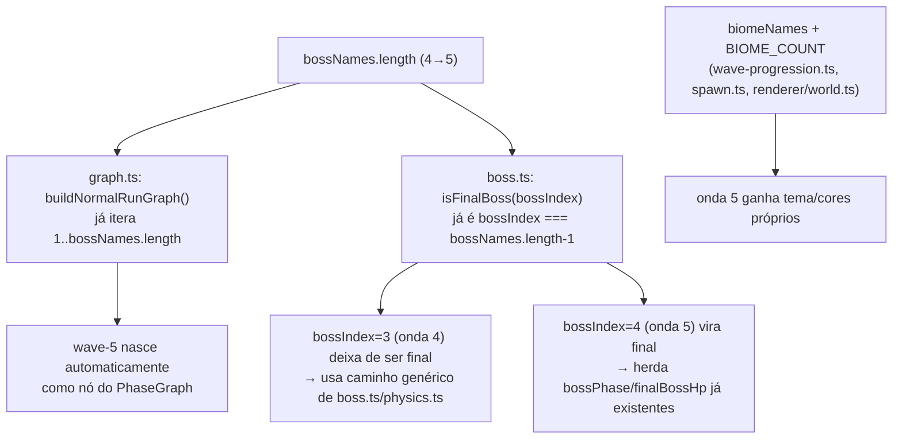

# Separar Go-Live/Diretoria Design

**Spec**: `_docs/specs/features/separar-golive-diretoria/spec.md`
**Status**: Draft

---

## Architecture Overview

Nenhum componente novo, nenhum tipo novo, nenhuma mudança de lógica em `graph.ts`/`boss.ts`/`waves.ts`/`physics.ts`. A feature inteira é uma expansão de **dados** de 4 para 5 entradas em 4 arrays hoje acoplados 1:1 por índice (`bossNames`, `biomeNames`, `obstacleTemplates`, os 2 arrays de cor de `drawGrid`) + o bump de 2 cópias da constante `BIOME_COUNT` que os limitam.



`AD-010` (`STATE.md`) é a restrição de projeto ativa: motor sem `react`, organizado por `Phase`. Este design conforma-se a ela — nenhuma Phase nova é criada, nenhum import de `react` é introduzido.

---

## Code Reuse Analysis

### Existing Components to Leverage

| Component | Location | How to Use |
| --- | --- | --- |
| `buildNormalRunGraph()` | `lib/pixel-hunt-engine/phases/normal-run/graph.ts:41-54` | Nenhuma mudança — já itera `for (n = 1; n <= bossNames.length; n++)`; gera `wave-5` sozinho assim que `bossNames` cresce. |
| `isFinalBoss(bossIndex)` | `lib/pixel-hunt-engine/phases/normal-run/boss.ts:23-25` | Nenhuma mudança — `bossIndex === bossNames.length - 1` passa a apontar para o índice 4 automaticamente. |
| Caminho de boss não-final (`spawnEnemy`, `computeBossVolleyPlan` pattern `bossIndex % 4`) | `lib/pixel-hunt-engine/phases/normal-run/spawn.ts:122-124`, `lib/pixel-hunt-engine/physics.ts:358-371` | Passa a ser exercitado pela onda 4 pela primeira vez (`pattern === 3`, já implementado e testado como função pura). |
| Caminho de boss final escalável (`bossPhase`, `finalBossHp`) | `lib/pixel-hunt-engine/physics.ts:37-39, 358-371, 567-582` | Nenhuma mudança — passa a se aplicar à onda 5 (`wave` já é parâmetro das fórmulas). |
| `ObstacleKind` | `lib/pixel-hunt-engine/types.ts:25` | Já tem kinds não usados hoje em `obstacleTemplates` (`rack`, `crt`, `chair`) suficientes para compor o 5º tema sem novo kind. |
| Mob "Legado" | `lib/pixel-hunt-engine/phases/normal-run/spawn.ts:25-31, 120` | Já implementado, liberado por `wave >= 5` — passa a ser alcançável, zero mudança de código. |

### Integration Points

| System | Integration Method |
| --- | --- |
| `PhaseGraph` (`types.ts`) | Nenhuma — consumido do jeito que já é, só com um nó a mais gerado pelo loop existente. |
| HUD (`waves.ts.hudLabels()`, `final-choice-phase.ts.hudLabels()`) | Já lê `bossNames[run.bossIndex]`/`biomeNames[...]` por índice — passa a ler o índice 4 assim que os arrays crescerem. |

---

## Components

Nenhum componente novo. Mudanças são edições pontuais em 3 arquivos existentes — listadas como "Data" abaixo em vez de "Components" (não há interface/classe nova para descrever).

---

## Data Models

### Roster de chefes/biomas (dados de conteúdo, não tipos)

`lib/pixel-hunt-engine/phases/normal-run/wave-progression.ts`

```typescript
export const bossNames = [
  "Gerente de Sprint",
  "Dono do Roadmap",
  "Arquiteto das Reuniões",
  "Diretor do Go-Live",
  "Comitê Executivo",       // NOVO — índice 4, onda 5 (Assumption A1)
];

export const biomeNames = [
  "Escritório",
  "Produção",
  "Cloud",
  "War Room",
  "Sala do Conselho",       // NOVO — índice 4, onda 5 (Assumption A2)
];
```

Nota: o Actor da onda 5, quando `finalBoss === true`, continua rotulado `"Diretoria"` (hardcoded em `spawn.ts:139`, não em `bossNames[4]`) — `bossNames[4] = "Comitê Executivo"` só aparece no HUD via `hudLabels()` **antes** da transição para `final-choice` (mesmo padrão de hoje, em que `bossNames[3]` nunca aparece como label do Actor final, só no HUD).

### Tema visual da onda 5 (`spawn.ts`)

```typescript
const BIOME_COUNT = 5; // era 4

// 5º conjunto, índice 4 — reaproveita ObstacleKind já existentes e não usados em outro tema
[
  { kind: "board", label: "Pauta", width: 80, height: 46 },
  { kind: "chair", label: "Cadeira de couro", width: 40, height: 44 },
  { kind: "rack", label: "Servidor de backup", width: 58, height: 70 },
]
```

### Cores do piso da onda 5 (`renderer/world.ts`)

```typescript
const BIOME_COUNT = 5; // era 4

const floor = ["#101827", "#1b1620", "#071a2f", "#211414", "#1a1408"][theme] ?? "#101827"; // + 1 tom (mogno escuro, tema "sala de reunião executiva")
const tile  = ["#132033", "#261b2c", "#0d2745", "#321b1b", "#2b2210"][theme] ?? "#132033";
```

Cores exatas (hex) ficam a critério de quem implementa a task — só precisam ser distintas dos 4 tons existentes e visualmente coerentes com "Sala do Conselho" (paleta mogno/dourado, contraste com o vermelho de "War Room").

**Relacionamento:** os 3 blocos acima são independentes entre si (arquivos diferentes) mas **acoplados por índice** — todos indexam por `bossIndex`/`Math.min(bossIndex, N-1)`. Uma task deve validar os 3 juntos (é o ponto mais fácil de errar: esquecer 1 dos 2 `BIOME_COUNT` e a onda 5 herdar visualmente o tema da onda 4 apesar do nome de bioma já ter mudado no HUD).

---

## Error Handling Strategy

| Error Scenario | Handling | User Impact |
| --- | --- | --- |
| Um dos 2 `BIOME_COUNT` é esquecido em 5 (só 1 dos 2 é atualizado) | Nenhum erro em runtime — `Math.min(bossIndex, BIOME_COUNT-1)` só clampa silenciosamente pro tema da onda 4 | HUD mostra "Sala do Conselho" mas a arena/piso continuam com a cara de "War Room" — inconsistência visual silenciosa, não um crash. Mitigado por um AC de Design explícito checando os 2 arquivos juntos (task de QA cruzada). |
| Teste existente com valor de HP/kill-target hardcoded para "o chefe final" (em vez de chamar `finalBossHp`/`bossKillTarget`) | Falha no gate da task correspondente | A task que introduz a 5ª entrada de `bossNames` quebra esse teste imediatamente — tratado como achado a corrigir (chamar a fórmula em vez de repetir o literal), não como scope creep (spec Edge Case já cobre isso). |

---

## Risks & Concerns

| Concern | Location (file:line) | Impact | Mitigation |
| --- | --- | --- | --- |
| `BIOME_COUNT = 4` duplicada em 2 arquivos (`spawn.ts:16`, `renderer/world.ts:15`), sem fonte única | `lib/pixel-hunt-engine/phases/normal-run/spawn.ts:16`, `lib/pixel-hunt-engine/renderer/world.ts:15` | Já é tech debt hoje (2 cópias que podem dessincronizar); esta feature soma uma 3ª dimensão acoplada por índice (`biomeNames.length`, hoje só clampado via `Math.min(..., biomeNames.length - 1)`, não uma constante própria). Risco de esquecer 1 das 2 constantes ao bumpar. | Mitigado por uma task dedicada de QA cruzada (ver Data Models acima) que verifica as 3 fontes (`bossNames`, `biomeNames`, `BIOME_COUNT`×2) em conjunto antes do commit da task de conteúdo. Consolidar numa fonte única fica fora de escopo (Assumption A6 do spec — não é objetivo desta feature). |
| Array de cores hardcoded por índice posicional (`drawGrid`, `renderer/world.ts:99-100`) sem nomeação — fácil trocar a ordem por engano ao editar | `lib/pixel-hunt-engine/renderer/world.ts:99-100` | Cor errada aplicada à onda errada, silenciosamente (sem erro) | Mesma mitigação acima — task de QA cruzada inclui checagem visual manual (screenshot/QA) da onda 5 antes de fechar. |
| Nenhum teste automatizado hoje cobre a cor de piso por onda (`drawGrid` não parece ter suíte dedicada) | `lib/pixel-hunt-engine/renderer/world.ts` | Gap de cobertura pré-existente, não introduzido por esta feature | Fora de escopo corrigir cobertura de renderer nesta feature (não pedido pelo spec); QA manual cobre o visual. |

> Nenhum risco de segurança, performance ou concorrência identificado — mudança é só de dados de conteúdo consumidos por loops já existentes.

---

## Tech Decisions

| Decision | Choice | Rationale |
| --- | --- | --- |
| Onde adicionar as 5ªs entradas | `wave-progression.ts` (`bossNames`/`biomeNames`), `spawn.ts` (`obstacleTemplates`/`BIOME_COUNT`), `renderer/world.ts` (`BIOME_COUNT`/paletas de cor) — os mesmos arquivos que já têm os arrays de 4, nenhum arquivo novo | Segue o padrão de localização já estabelecido pelo próprio código (comentários em `spawn.ts`/`graph.ts` já apontam que o roster escala "sozinho" a partir de `bossNames.length`) |
| Reuso de `ObstacleKind` existentes (`board`/`chair`/`rack`) para o tema da onda 5, sem novo kind | Confirmado em `types.ts:25` — `chair`/`rack`/`crt` já existem no union e não são usados em nenhum `obstacleTemplates` atual | Evita expandir o tipo `ObstacleKind` (mudança de tipo = superfície maior) quando o union já cobre a necessidade |
| Não consolidar as 2 cópias de `BIOME_COUNT` numa fonte única | Mantém a duplicação (Assumption A6 do spec) | Fora do pedido do usuário; consolidar seria refactor oportunista não relacionado ao objetivo da feature |

---

## Confirmação

Design straightforward o suficiente para não precisar de exploração de 2-3 abordagens (não há decisão arquitetural real em aberto — é expansão de dados sobre um mecanismo já genérico). Seguindo direto para Tasks.
