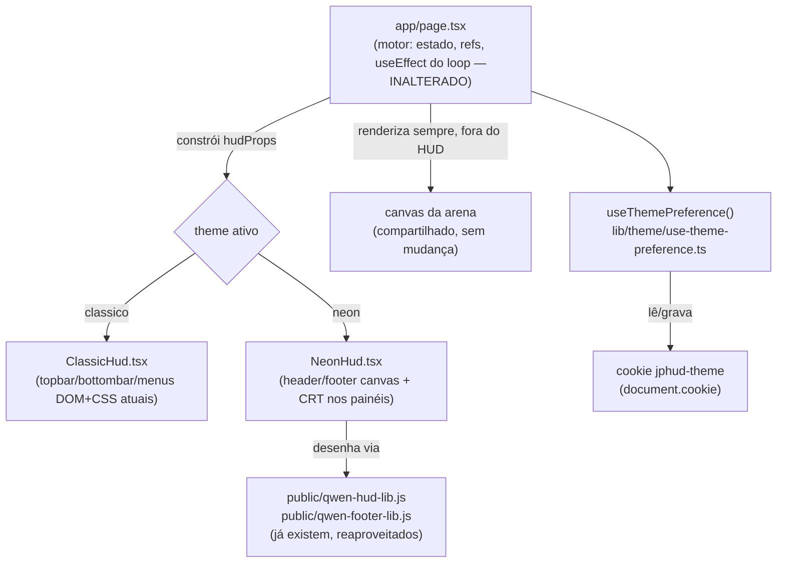

# Sistema de Temas de HUD Design

**Spec**: `_docs/specs/features/sistema-de-temas-hud/spec.md`
**Status**: Draft

---

## Approach Exploration

Três formas de eliminar a duplicação entre Clássico e Neon, avaliadas contra o mesmo objetivo (nenhuma lógica de jogo duplicada) com riscos bem diferentes, porque `app/page.tsx` tem hoje **um único `useEffect` de ~1300 linhas** (linha 660–1980) que concentra spawn, física, colisão, desenho do mundo e input — a parte mais frágil e mais testada em produção do projeto (`STATE.md` já registra dois bugs de produção — `AD-006`, `AD-007` — nascidos de refactors menores que esse).

### Opção 1 (recomendada): Split só na apresentação — motor fica onde está

Todo o estado, os `useRef`, os `useCallback` de áudio/menu e o `useEffect` gigante do jogo **continuam exatamente em `app/page.tsx`, sem mover uma linha**. Só a árvore JSX que hoje é renderizada inline (topbar, bottombar, telas de menu) é extraída para dois componentes-irmãos que recebem os mesmos valores/handlers via props — a única coisa que já está de fato duplicada entre `/clude` e `/qwen` hoje é a apresentação, não o motor.

- **Risco**: baixo — zero mudança na lógica de jogo já validada em produção; o diff é presentacional (JSX/CSS), do mesmo tipo que já foi feito (e verificado) nos dois estudos.
- **Esforço**: médio — ainda é preciso portar o header/footer canvas do Neon (as libs `qwen-hud-lib.js`/`qwen-footer-lib.js`) e o CRT dos demais painéis, só que agora alimentados por props em vez de estado duplicado.
- **Satisfaz "sem duplicação"?** Sim — existe uma única cópia do motor (em `app/page.tsx`) e uma única cópia de cada apresentação (`ClassicHud.tsx`, `NeonHud.tsx`).

### Opção 2: Extrair o motor inteiro para um hook (`useGameEngine`)

Move as ~1750 linhas de estado/refs/callbacks/efeitos para `lib/game-engine/useGameEngine.ts`; `app/page.tsx` vira só a chamada do hook + despacho de tema.

- **Risco**: alto — mover um `useEffect` de 1300 linhas cheio de closures (que capturam `let` locais como `localScore`, `bossKills`, `enemies` — não são refs) para outro módulo exige reproduzir exatamente a mesma ordem de inicialização e as mesmas dependências (`[]`) sem alterar timing nenhum. É o tipo de mudança que historicamente já gerou os bugs registrados em `AD-006`/`AD-007`.
- **Esforço**: alto — mesmo sendo "mecânico" (cortar e colar), a superfície de revisão é o arquivo inteiro do jogo.
- **Satisfaz "sem duplicação"?** Sim, e de forma mais "pura" architeturalmente — mas o ganho sobre a Opção 1 é só organizacional (o motor vira importável/testável isoladamente), não elimina duplicação que a Opção 1 já elimina.

### Opção 3: Extrair só estado+handlers pequenos, deixar o loop de física em `page.tsx`

Meio-termo: move `useState`/`useRef`/callbacks de áudio para um hook, mas o `useEffect` de física continua em `page.tsx` (porque ele lê e escreve nesses mesmos `useState`/`useRef` via closure).

- **Risco**: médio, mas cria uma dependência estranha (o hook expõe setters que só fazem sentido junto com o efeito que ficou para trás) — separação artificial sem benefício real.
- **Descartada**: não resolve nada que a Opção 1 não resolva, e ainda assim toca no motor.

**Recomendação: Opção 1.** Entrega exatamente o que a spec pede (zero duplicação de motor, dois temas completos) com o menor risco possível para o jogo publicado. A Opção 2 fica registrada como possível trabalho futuro puramente organizacional, não é necessária para esta feature.

---

## Architecture Overview



`app/page.tsx` continua sendo o único dono do estado do jogo. A cada render, ele monta um objeto `hudProps` (valores + handlers já existentes, sem lógica nova) e escolhe qual componente de apresentação renderizar. O canvas da arena (`<canvas ref={canvasRef}>`) continua sendo renderizado por `page.tsx`, não pelos componentes de tema — só o que envolve a arena (header, footer, moldura, telas de menu) é trocável.

---

## Code Reuse Analysis

### Existing Components to Leverage

| Component | Location | How to Use |
| --- | --- | --- |
| JSX/CSS do tema Clássico | `app/page.tsx` (topbar/bottombar/menus atuais) | Extrair sem alterar — vira `ClassicHud.tsx` + `classic.css` (cópia 1:1, só movida) |
| JSX/CSS do tema Neon | `app/qwen/hud-redesign/page.tsx` + `app/qwen/hud-redesign/study.css` | Portar as seções de header/footer/painéis/CSS pra `NeonHud.tsx` + `neon.css`, adaptando pra receber `hudProps` em vez de estado local duplicado |
| `PixelHUD` / `PixelFooter` | `public/qwen-hud-lib.js`, `public/qwen-footer-lib.js` | Reaproveitar como estão — já são bibliotecas isoladas (IIFE) carregadas via `next/script`, sem mudança |
| Painel "Apoie o jogo" (`supportOpen`/`openSupportPanel`) | `app/page.tsx:280,560` | Mesmo padrão pro novo painel de Configurações (`settingsOpen`/`openSettingsPanel`) — não usa a union `MenuPanel`, é um boolean próprio, igual ao suporte |
| `.frame-panel`/CRT styling | `app/qwen/hud-redesign/study.css` | Reaproveitado tal como validado, movido pro `neon.css` do tema |

### Integration Points

| System | Integration Method |
| --- | --- |
| Controle de som existente (`muted`/`volume`/`setMuted`/`setVolume`) | O painel de Configurações usa os MESMOS setters já passados em `hudProps` — não cria estado de áudio novo |
| Navegação do menu inicial (`menuIndex`, `activateMenuOption`, wrap-around no teclado) | Remapeado de 4 para 5 itens (ver Tech Decisions) — mesmo mecanismo, só mais um índice |
| `isDebugAllowed()` / debug outputs | Sem mudança — cada tema mantém a mesma faixa de debug já validada em `/clude` e `/qwen` |

---

## Components

### `useThemePreference` (hook)

- **Purpose**: Ler o cookie `jphud-theme` no mount, expor o tema ativo e uma função para trocá-lo (que também grava o cookie).
- **Location**: `lib/theme/use-theme-preference.ts`
- **Interfaces**:
  - `useThemePreference(): { theme: "classico" | "neon"; setTheme: (t: "classico" | "neon") => void }`
- **Dependencies**: `document.cookie` (client-only, chamado dentro de `useEffect`/handler, nunca no corpo do render, pra não quebrar SSR)
- **Reuses**: nada existente — é a única peça de estado genuinamente nova na feature

### `lib/theme/theme-cookie.ts` (helpers puros)

- **Purpose**: Isolar o parsing/serialização do cookie do hook, pra ser testável sem DOM.
- **Location**: `lib/theme/theme-cookie.ts`
- **Interfaces**:
  - `parseThemeCookie(cookieHeader: string): "classico" | "neon" | null` — retorna `null` se ausente ou valor inválido (não lança erro)
  - `serializeThemeCookie(theme: "classico" | "neon"): string` — string pronta pra `document.cookie = ...`, com `path=/; max-age=31536000`
- **Dependencies**: nenhuma (funções puras de string)
- **Reuses**: nenhum — mas segue o padrão já usado no projeto de manter lógica pura testável fora de `app/page.tsx` (`lib/cheat-codes.ts`, `lib/obstacles.ts` são o precedente)

### `ClassicHud` (componente de apresentação)

- **Purpose**: Renderizar topbar, bottombar e todas as telas de menu exatamente como o jogo publicado hoje.
- **Location**: `app/_hud/classic/ClassicHud.tsx` (+ `classic.css` no mesmo diretório) — prefixo `_` faz o Next.js App Router ignorar a pasta como rota
- **Interfaces**:
  - `<ClassicHud {...props} />` — `props: HudProps` (ver abaixo)
- **Dependencies**: `HudProps`
- **Reuses**: é a extração 1:1 do JSX/CSS que já existe em `app/page.tsx` hoje — nenhum comportamento novo

### `NeonHud` (componente de apresentação)

- **Purpose**: Renderizar a versão neon (header/footer canvas, avatar Doom-style, painéis CRT), igual ao validado em `/qwen/hud-redesign`.
- **Location**: `app/_hud/neon/NeonHud.tsx` (+ `neon.css` no mesmo diretório)
- **Interfaces**:
  - `<NeonHud {...props} />` — mesmo `HudProps` do `ClassicHud`
- **Dependencies**: `public/qwen-hud-lib.js`, `public/qwen-footer-lib.js` (via `next/script`), `HudProps`
- **Reuses**: JSX/CSS/lógica de canvas do estudo `/qwen/hud-redesign`, adaptado pra ler de props em vez de duplicar estado

### `HudProps` (contrato entre motor e tema)

- **Purpose**: Único tipo que os dois componentes de tema recebem — a "interface motor↔tema" que a spec pediu para deixar explícita.
- **Location**: `app/_hud/hud-props.ts` (tipo compartilhado, sem lógica)
- **Formato** (campos já existentes em `app/page.tsx` hoje, só agrupados):

```typescript
interface HudProps {
  // leitura
  status: string; hp: number; score: number; wave: number; resetCount: number;
  boss: string; biome: string; upgrade: string; bossProgress: string;
  burstStaminaPct: number; abilityCooldownPct: number;
  muted: boolean; volume: number;
  gameState: GameState; menuPanel: MenuPanel; menuIndex: number;
  highScores: HighScore[]; selectedCharacterId: string;
  settingsOpen: boolean; theme: "classico" | "neon";
  // debug (já existentes, repassados como estão)
  debugBossHealth: { hp: number; maxHp: number } | null;
  debugPowerUpCount: number; debugAbilityCooldown: number;
  debugPlayerPosition: { x: number; y: number };
  debugPlayerEffects: { haste: number; invincible: number };
  // ação
  setMuted: (v: boolean | ((c: boolean) => boolean)) => void;
  setVolume: (v: number) => void;
  setMenuIndex: (i: number) => void;
  activateMenuOption: (index: number) => void;
  setMenuPanel: (p: MenuPanel) => void;
  openSettingsPanel: () => void; closeSettingsPanel: () => void;
  setTheme: (t: "classico" | "neon") => void;
  startNewGame: () => void; resumeGame: () => void; returnToTitle: () => void;
  // refs (repassadas, os componentes de tema só as anexam ao <canvas>/elementos)
  characterPortraitRefs: React.RefObject<Array<HTMLCanvasElement | null>>;
  debugFirstActionRef: React.RefObject<HTMLButtonElement | null>;
}
```

> Nenhum campo aqui é novo — é uma extração do que já são as props implícitas (closures) que o JSX de `app/page.tsx` usa hoje. `theme`/`setTheme`/`settingsOpen`/`openSettingsPanel`/`closeSettingsPanel` são os únicos itens genuinamente novos.

### Painel de Configurações (dentro de cada `*Hud.tsx`)

- **Purpose**: UI de seleção de tema + volume, no estilo de cada tema (não é um componente próprio — é uma seção JSX curta dentro de `ClassicHud`/`NeonHud`, igual ao padrão já usado pro painel "Apoie o jogo").
- **Interfaces**: nenhuma própria — usa `hudProps.theme`, `hudProps.setTheme`, `hudProps.muted`, `hudProps.volume`, `hudProps.setMuted`, `hudProps.setVolume`
- **Reuses**: os mesmos controles de som (botão mute + slider) já existentes em cada tema, só reposicionados

---

## Data Models

### Cookie `jphud-theme`

```typescript
type ThemeId = "classico" | "neon";

// document.cookie = serializeThemeCookie(theme)
// → "jphud-theme=neon; path=/; max-age=31536000; samesite=lax"
```

| Campo | Valor | Rationale |
| --- | --- | --- |
| Nome | `jphud-theme` | Namespaced com o prefixo do projeto (`jp` = Java Pleno), evita colisão |
| Valores válidos | `"classico"` \| `"neon"` | Union fechada — qualquer outro valor lido é tratado como ausente (THEME-18) |
| `path` | `/` | Precisa valer pro domínio inteiro, não só a rota atual |
| `max-age` | `31536000` (1 ano) | Confirmado na spec |
| `samesite` | `lax` | Padrão seguro sem quebrar navegação normal; não há necessidade de `strict` (não é dado sensível) nem de enviar cross-site |
| `httpOnly` | não se aplica (cookie de client, sem servidor envolvido) | Precisa ser lido/escrito via `document.cookie` no client |

**Relacionamento**: nenhum — é um valor solto, sem relação com `HighScore` ou outros modelos do projeto.

---

## Error Handling Strategy

| Error Scenario | Handling | User Impact |
| --- | --- | --- |
| Cookie ausente no primeiro acesso | `parseThemeCookie` retorna `null` → hook usa `"classico"` | Jogo abre no tema clássico, sem erro |
| Cookie com valor corrompido/antigo | `parseThemeCookie` valida contra a union e retorna `null` se não bater | Mesmo fallback acima — nunca lança exceção |
| Cookies bloqueados pelo navegador (modo privado) | `document.cookie = ...` falha silenciosamente (comportamento nativo do browser) — o hook não depende do retorno da escrita | Tema escolhido continua valendo durante a sessão; só não persiste na próxima visita — sem erro visível |
| `window.PixelHUD`/`window.PixelFooter` ainda não carregaram quando o tema Neon é selecionado no meio da sessão | `NeonHud` já implementa espera (`waitForLib`, poll de 50ms) — padrão validado no estudo | Header/footer aparecem em branco por no máximo ~50-100ms até os scripts carregarem, depois desenham normalmente |

---

## Risks & Concerns

| Concern | Location | Impact | Mitigation |
| --- | --- | --- | --- |
| `useEffect` de física com ~1300 linhas e closures sobre `let` locais (não refs) | `app/page.tsx:660-1980` | Qualquer refactor que mova ou reordene esse bloco é alto risco de regressão silenciosa | Design escolhido (Opção 1) explicitamente NÃO toca nesse bloco — ele continua exatamente onde está |
| Extrair o JSX do tema Clássico pode, por acidente, mudar algum `className`/estrutura que teste existente ou CSS externo dependa | `app/page.tsx` (JSX de retorno, linhas ~1980-2498) | Quebra visual sutil no jogo publicado | Extração é literal (copiar+colar, sem reescrever), e `npm run build`/testes existentes rodam antes/depois de cada task como gate |
| `public/qwen-hud-lib.js`/`qwen-footer-lib.js` já são carregados por `/qwen/hud-redesign` — se essa rota continuar existindo depois desta feature, os mesmos scripts carregam em duas rotas diferentes | `public/qwen-hud-lib.js` | Nenhum — cada rota carrega seu próprio `<script>`, sem estado compartilhado entre abas/rotas | Sem mitigação necessária; falado explicitamente no Out of Scope da spec (remoção de `/qwen` não é desta feature) |
| Cookie lido só no client (sem SSR) causa 1 frame no tema padrão antes de aplicar o salvo | `useThemePreference` | "Flash" visual muito breve pra quem tem Neon salvo | Assumido e documentado na spec como trade-off aceito (THEME-16 não exige zero-flash) |

> Nenhum risco de segurança identificado — cookie não carrega dado sensível, é só uma preferência de UI.

---

## Tech Decisions

| Decision | Choice | Rationale |
| --- | --- | --- |
| Onde o motor do jogo mora | Continua em `app/page.tsx`, inalterado | Opção 1 escolhida — ver Approach Exploration |
| Como o tema é selecionado no JSX | `theme === "neon" ? <NeonHud .../> : <ClassicHud .../>` dentro de `app/page.tsx`, arena renderizada fora/entre os dois | Mais simples que um registry de temas — só 2 temas nesta feature, `Out of Scope` já diz que mais temas não são desta rodada |
| Pasta dos componentes de tema | `app/_hud/classic/` e `app/_hud/neon/` (prefixo `_` = ignorado pelo App Router) | Mantém o código perto da rota real sem virar uma rota própria; evita reintroduzir o problema do `AD-008` (esses arquivos não são rotas, então podem exportar o que precisarem) |
| Remap do índice do menu inicial | 4 itens (`%4`) → 5 itens (`%5`); Configurações entra no índice 2, empurrando Como Jogar→3 e Apoie o jogo→4 | Confirmado pelo usuário: Configurações é o 3º item visualmente |
| Nome/local do cookie | `jphud-theme`, `lib/theme/theme-cookie.ts` para parse/serialize puros + `lib/theme/use-theme-preference.ts` para o hook client | Segue o padrão já existente no projeto de lógica pura em `lib/`, testável sem DOM |

> **Project-level**: a decisão "Opção 1 (split presentacional, motor não migra)" e o padrão `app/_hud/` (pasta prefixada `_` para componentes de tema fora de rota) são registradas como próximo `AD-009` em `_docs/specs/STATE.md`, porque qualquer tema futuro (fora do escopo desta feature) deve seguir o mesmo padrão.
