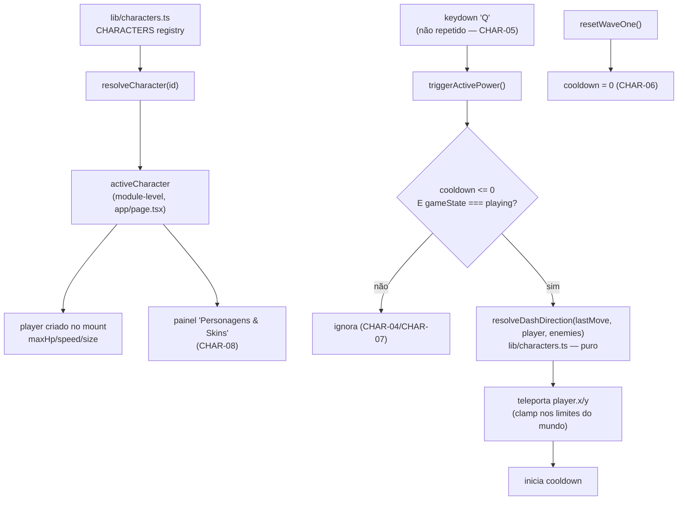
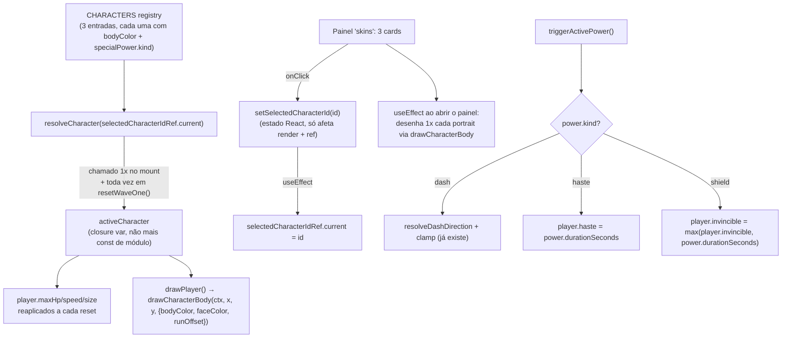

# Sistema de Personagens Design

**Spec**: `_docs/specs/features/sistema-personagens/spec.md`
**Status**: Draft

---

## Architecture Overview

O jogador hoje é um objeto literal criado uma única vez dentro do grande `useEffect` "motor do jogo" (`app/page.tsx:608-1861`), com `maxHp`/`speed`/`size` fixos no código. Essa arquitetura não muda: continua um único objeto `player`, criado uma vez, mutado a cada frame. A única mudança estrutural é **de onde vêm os números** — de um registry de personagens (`lib/characters.ts`, novo módulo puro) em vez de literais.

Como só 1 personagem entra nesta entrega (decisão do usuário) e não há seletor, `activeCharacter` é resolvido **uma única vez, em module scope** de `app/page.tsx` (não é estado React, não muda em runtime) — o mesmo padrão já usado para `adsenseClientId`/`adsenseBannerSlotId` no topo do arquivo. Isso evita construir estado/seleção que não tem consumidor nesta entrega (nenhum picker), mantendo o corte de escopo real. O ponto de extensão para o futuro é a *assinatura* de `resolveCharacter(id)` — pronta para receber um id dinâmico quando a UI de seleção existir — não um estado especulativo sem uso hoje.



---

## Code Reuse Analysis

### Existing Components to Leverage

| Component | Location | How to Use |
| --- | --- | --- |
| `normalize(x, y)` | `app/page.tsx:168` | Já usado para o vetor de movimento (`move`); o valor resultante (`move.x`/`move.y`) é capturado a cada frame como "última direção de movimento" para alimentar o dash. Não precisa duplicar a normalização do input — só guardar o resultado já calculado. |
| `clamp(value, min, max)` | `app/page.tsx:156` | Reaproveitado para limitar o destino do teleporte aos limites do mundo (mesmo padrão já usado em `spawnFinalChoices`, `update`). |
| `distance(a, b)` | `app/page.tsx:160` | Mesma fórmula (`Math.hypot`) reaproveitada — mas duplicada como função interna pura em `lib/characters.ts` (ver Risco R1 abaixo), não importada, porque `app/page.tsx` é arquivo de rota (AD-008: lógica pura sai de `app/page.tsx`, nunca o inverso). |
| Debug HUD (`debugBossHealth`, `debugPowerUpCount`, gate `isDebugAllowed()`) | `app/page.tsx:247-248`, `lib/debug.ts` | Mesmo padrão (elementos `role="status"`, só em `development`) estendido com dois novos campos de observabilidade (cooldown do poder e posição do jogador) — necessário para testar CHAR-03/04/05 sem ler pixels do canvas. Ver Tech Decisions. |
| `resetWaveOne()` | `app/page.tsx:754` | Já reseta `burstStamina`, `weaponLevel` etc a cada nova partida/"novo chamado" — ganha uma linha a mais para zerar o cooldown do poder (CHAR-06). |
| Painel "skins" já commitado | `app/page.tsx` (feature de cheat code desta sessão) | O placeholder "em construção" é substituído pelo conteúdo real; o gate (`iddqd`/`idkfa`, `menuPanel === "skins"`) não muda. |
| Padrão de teste MSW/render (`app/__tests__/hidden-menu.test.tsx`, `game-debug.test.tsx`) | `app/__tests__/` | Mesmo padrão de `render(<Home />)` + `fireEvent.keyDown` + `screen.getByRole` para os testes de integração desta feature. |

### Integration Points

| System | Integration Method |
| --- | --- |
| Motor do jogo (`useEffect` único, `app/page.tsx`) | `player` lê `activeCharacter.maxHp/speed/size` na criação (uma vez, no mount) — nenhuma mudança na forma como o efeito já funciona hoje. |
| Debug HUD (`lib/debug.ts` + estado React `debugBossHealth`-like) | Dois novos campos de status só-leitura, mesmo gate `isDebugAllowed()`. |
| Painel de menu "skins" | Troca de conteúdo estático (placeholder) por dados lidos de `activeCharacter`, sem mudar o mecanismo de abertura do painel. |

---

## Components

### `lib/characters.ts` (novo)

- **Purpose**: Registry de personagens (dados) + resolução de personagem + geometria pura do poder especial (direção do dash). Único lugar onde um personagem futuro é adicionado.
- **Location**: `lib/characters.ts`
- **Interfaces**:
  - `resolveCharacter(id: string | undefined): CharacterDefinition` — retorna a definição pelo `id`; cai no primeiro item do registry se `id` for `undefined` ou não existir (CHAR-02).
  - `resolveDashDirection(moveDirection: Vector2, player: Vector2, enemies: readonly Vector2[]): Vector2` — vetor unitário: usa `moveDirection` se não-zero; senão mira no inimigo mais próximo; senão `(0, -1)`. Função pura, sem acesso a DOM/canvas (Edge Cases da spec).
- **Dependencies**: nenhuma (módulo puro, sem I/O).
- **Reuses**: nenhuma dependência externa nova — replica localmente a fórmula de distância (`Math.hypot`) já usada em `app/page.tsx`, sem importar do arquivo de rota (ver Risco R1).

### `app/page.tsx` (modificado)

- **Purpose**: Consome o registry para inicializar o jogador e para acionar/renderizar o poder especial; sem mudança de responsabilidade do arquivo.
- **Mudanças**:
  - `const activeCharacter = resolveCharacter(DEFAULT_CHARACTER_ID);` — module scope, junto de `adsenseClientId`.
  - Criação do `player` (linha ~638) passa a ler `activeCharacter.maxHp/speed/size` em vez de `100/210/24`.
  - Novas variáveis de closure no motor do jogo: `abilityCooldownRemaining`, `lastMoveX`, `lastMoveY` (mesmo padrão de `burstStamina`).
  - `update(delta)`: decrementa `abilityCooldownRemaining`; grava `lastMoveX/lastMoveY = move.x/move.y` a cada frame (reaproveita o `move` já calculado).
  - Nova função `triggerActivePower()`: guarda de estado (`gameState === "playing"`) + guarda de cooldown + chama `resolveDashDirection` + `clamp` no destino + inicia cooldown.
  - `onKeyDown`: novo branch `if (event.key.toLowerCase() === "q" && !event.repeat) triggerActivePower();` (após a guarda `isTyping`).
  - `resetWaveOne()`: `abilityCooldownRemaining = 0;`.
  - Painel `menuPanel === "skins"`: conteúdo real (nome, atributos, poder) no lugar do placeholder.
  - Debug HUD: dois novos `role="status"` (cooldown do poder, posição do jogador), atrás do mesmo `isDebugAllowed()`.

---

## Data Models

### `CharacterSpecialPower`

```typescript
type CharacterSpecialPower = {
  id: string;
  name: string;
  description: string;
  cooldownSeconds: number;
  dashDistance: number;
};
```

### `CharacterDefinition`

```typescript
type CharacterDefinition = {
  id: string;
  name: string;
  maxHp: number;
  speed: number;
  size: number;
  specialPower: CharacterSpecialPower | null; // null = personagem sem poder (Edge Case da spec)
};
```

**Relationships**: `CHARACTERS: readonly CharacterDefinition[]` é o catálogo; `DEFAULT_CHARACTER_ID = CHARACTERS[0].id`. Adicionar um personagem = adicionar um objeto ao array (CHAR-09).

Catálogo inicial (1 entrada, CHAR-01):

```typescript
{
  id: "dev-pleno",
  name: "Dev Pleno",
  maxHp: 100,
  speed: 210,
  size: 24,
  specialPower: {
    id: "refactor-dash",
    name: "Refactor Dash",
    description: "Teleporte curto na direção do movimento.",
    cooldownSeconds: 6,
    dashDistance: 140,
  },
}
```

> `dashDistance: 140` é um valor de balanceamento arbitrário (não vem da spec) — ver Tech Decisions.

---

## Error Handling Strategy

| Error Scenario | Handling | User Impact |
| --- | --- | --- |
| `resolveCharacter` recebe id desconhecido/`undefined` | Fallback para `CHARACTERS[0]` (CHAR-02) | Nenhum — jogo carrega normalmente com o personagem padrão |
| `Q` pressionado durante cooldown | `triggerActivePower` retorna sem efeito (CHAR-04) | Nenhum feedback visual nesta entrega (ver Tech Decisions) — jogador percebe pela ausência de movimento |
| `Q` pressionado fora de `gameState === "playing"` | Guard de estado dentro de `triggerActivePower` (CHAR-07) | Nenhum |
| Dash levaria o jogador para fora do mundo | `clamp` no destino final (Edge Case da spec) | Jogador para na borda, nunca sai da arena |
| Personagem sem `specialPower` (futuro) | `triggerActivePower` checa `power` nulo antes de agir; painel mostra "Sem poder especial" (Edge Case da spec) | Nenhum erro, comportamento explícito |

---

## Risks & Concerns

| Concern | Location (file:line) | Impact | Mitigation |
| --- | --- | --- | --- |
| R1 — Duplicação da fórmula de distância (`Math.hypot`) entre `app/page.tsx:160` e `lib/characters.ts` | `app/page.tsx:160` | Baixo: são 2 linhas, mas duas fontes da mesma fórmula podem divergir se uma mudar sem a outra. | Aceito conscientemente: `app/page.tsx` é arquivo de rota (AD-008), não pode ser importado por `lib/`. Extrair um `lib/geometry.ts` compartilhado é over-engineering para 2 linhas de fórmula padrão (`Math.hypot`) — não faço isso nesta entrega. |
| R2 — `keydown` nativo dispara em auto-repeat quando uma tecla fica pressionada | `app/page.tsx` (handler `onKeyDown`, ~linha 1030) | Sem a guarda `event.repeat`, seguraria `Q` disparia o poder centenas de vezes por segundo (CHAR-05 quebrado). | Guard explícito `!event.repeat` no branch do `Q`, coberto por teste dedicado (dispara `repeat: true` como o *primeiro* evento e confirma que não ativa nada, isolando esse comportamento do bloqueio por cooldown). |
| R3 — Não há indicador visual de cooldown na UI real (fora do debug) | `app/page.tsx` (painel "skins" / HUD) | Jogador não vê quando o poder volta a ficar disponível, exceto tentando de novo. | Fora do escopo da spec (nenhuma AC pede medidor visual) — decisão deliberada, não omissão silenciosa. Ver Tech Decisions. |
| R4 — `player` é criado uma única vez no mount do motor do jogo; não há recriação por partida além de `resetWaveOne` | `app/page.tsx:638-649` | Se um seletor de personagem for adicionado no futuro, trocar de personagem só vai valer a partir da próxima *página recarregada*, não da próxima partida — porque `activeCharacter` é constante de módulo, não estado. | Aceitável para esta entrega (não há seletor). Registrado aqui para quando o CHAR-EXT (seletor futuro) for especificado: `activeCharacter` provavelmente vira `useState` + leitura em `resetWaveOne()`, não só na criação do `player`. |

---

## Tech Decisions (only non-obvious ones)

| Decision | Choice | Rationale |
| --- | --- | --- |
| `activeCharacter` é constante de módulo, não estado React | `const activeCharacter = resolveCharacter(DEFAULT_CHARACTER_ID);` no topo do arquivo | Não há seletor nesta entrega (decisão do usuário); estado React sem nenhum consumidor (`setSelectedCharacterId` nunca chamado) seria código morto e provavelmente falharia lint. O ponto de extensão é a assinatura de `resolveCharacter(id)`, não um estado especulativo. |
| CHAR-02 (fallback) é validado no nível do registry, não via integração no app | Teste unitário chama `resolveCharacter("id-inexistente")` diretamente | Como só existe 1 personagem e nenhuma UI seta um id inválido em runtime, testar isso via `app/page.tsx` seria artificial; o comportamento real mora inteiramente em `resolveCharacter`. |
| CHAR-11 (sem persistência) verificado por ausência, não por um teste de "ciclo de vida" | Nenhum código de leitura/escrita em `localStorage` é introduzido para seleção de personagem | Não há o que persistir — não existe estado de seleção nesta entrega. Verificação = grep/inspeção confirmando que nenhuma chave nova de `localStorage` foi criada, documentado na validação (não precisa de teste dedicado). |
| Observabilidade de teste: dois campos novos no debug HUD (`cooldown do poder`, `posição do jogador`) | `role="status"`, atrás de `isDebugAllowed()`, mesmo padrão de `debugBossHealth`/`debugPowerUpCount` | CHAR-03/04/05 exigem provar que o teleporte e o bloqueio por cooldown realmente aconteceram — não há outra forma de observar posição/cooldown do jogador sem ler pixels do canvas (mock de `getContext` não expõe estado). Mesmo precedente já estabelecido pelos debug status existentes. |
| `dashDistance = 140` (pixels) | Valor fixo no registry, não na spec | A spec só define "distância fixa"; 140px é ~35% da altura do mundo (540px), suficiente para esquivar de um inimigo sem atravessar a arena inteira. Ajustável depois sem mudar arquitetura. |
| Sem medidor de cooldown na UI de produção | Nenhum elemento visual novo fora do debug HUD | Nenhuma AC da spec pede isso; adicionar seria escopo além do pedido (coding-principles: "no features beyond what was asked"). |
| CHAR-12 (emenda, achado de `/code-review`): dash atravessa obstáculos | `triggerActivePower` só faz `clamp` nos limites do mundo, sem chamar `obstacleBlocksCircle` — decisão do usuário: manter, é intencional (habilidade de escape) | O código-review apontou a ausência de checagem de colisão com obstáculo como inconsistência com o movimento normal; o usuário decidiu que essa é a intenção do poder (diferenciá-lo do movimento comum), não um bug — formalizado como AC em vez de corrigido |

> Nenhuma decisão aqui estabelece uma convenção de projeto nova além do já registrado em `AD-008` (lógica pura fora de `app/page.tsx`) — que já está em `STATE.md`. Sem novo `AD-NNN` necessário.

---

## Design — Emenda 2 (2026-08-29): Personagens visuais, poderes com mecânicas diferentes, seletor real

**Spec**: `_docs/specs/features/sistema-personagens/spec.md` (seção "Emenda 2")

### Architecture Overview

Três mudanças arquiteturais novas, todas reaproveitando estrutura que já existe:

1. **`CharacterSpecialPower` vira union discriminada por `kind`** (`"dash" | "haste" | "shield"`) em vez de sempre exigir `dashDistance`. `triggerActivePower` passa a despachar por `power.kind` (um `if/else`/`switch` sobre 3 casos, não por personagem) — CHAR-15/18.
2. **`activeCharacter` deixa de ser constante de módulo e vira uma variável de closure re-resolvida em `resetWaveOne()`** a partir de um `selectedCharacterIdRef` sincronizado com o novo estado React `selectedCharacterId`. Isso resolve o Risco R4 já registrado na Emenda 1 ("trocar de personagem só valeria após reload") — CHAR-22.
3. **O desenho do corpo do jogador é extraído de `drawPlayer()` para uma função `drawCharacterBody()` reutilizável**, parametrizada por cor — chamada tanto pelo jogo (com efeitos de fúria/piscar/animação de corrida) quanto por um retrato estático no seletor (sem efeitos, pose fixa) — CHAR-19/21.



### Code Reuse Analysis (Emenda 2)

| Componente existente | Local | Como é reaproveitado |
| --- | --- | --- |
| `player.haste` (multiplicador de velocidade 1.34x já lido em `update()`) | `app/page.tsx:1218` | O poder "haste" só faz `player.haste = power.durationSeconds` — o efeito de velocidade em si já existe e já é usado pelo power-up "coffee"/similar, zero lógica de movimento nova |
| `player.invincible` (já usado por `drawPlayer` pro efeito de piscar e por combate pra ignorar dano) | `app/page.tsx:1377-1388`, `1712` | O poder "shield" só faz `player.invincible = Math.max(player.invincible, power.durationSeconds)` — mesmo padrão `Math.max` já usado pelo power-up "rollback" |
| `pixelRect(ctx, x, y, w, h, color)` | `app/page.tsx:181` | Reaproveitada tal como está pra desenhar tanto o corpo no jogo quanto o retrato estático |
| Mock global de `getContext` já usado em todos os testes de componente | `app/__tests__/*.test.tsx` | Os 3 `<canvas>` novos do seletor recebem o mesmo mock — nenhuma mudança de setup de teste necessária |
| `resetWaveOne()` | `app/page.tsx` | Ganha 1 linha (`activeCharacter = resolveCharacter(...)`) além das que já reseta (`abilityCooldownRemaining = 0` da Emenda 1) — mesmo ponto de entrada pra "início de partida" |

### Components (novos/modificados)

#### `lib/characters.ts` (modificado)

- **`CharacterSpecialPower`**: vira union discriminada:
  ```typescript
  type CharacterSpecialPower =
    | { id: string; name: string; description: string; cooldownSeconds: number; kind: "dash"; dashDistance: number }
    | { id: string; name: string; description: string; cooldownSeconds: number; kind: "haste"; durationSeconds: number }
    | { id: string; name: string; description: string; cooldownSeconds: number; kind: "shield"; durationSeconds: number };
  ```
- **`CharacterDefinition`**: ganha campo `bodyColor: string` (obrigatório — inclusive pro "Dev Pleno" já existente, que passa a declarar `bodyColor: "#0ea5e9"` explicitamente em vez de a cor ficar hardcoded em `drawPlayer()`).
- **`CHARACTERS`**: ganha 2 entradas (Estagiário, SRE) com os valores da tabela de Assumptions da spec.
- **Sem novas funções puras**: `resolveCharacter`/`resolveDashDirection` não mudam de assinatura; a lógica de haste/shield é trivial demais pra justificar extração (1 linha cada), fica direto em `triggerActivePower`.

#### `app/page.tsx` (modificado)

- **`drawCharacterBody(ctx, x, y, options)`** (nova função standalone, ao lado de `pixelRect`): desenha só a identidade recolorável do sprite (cabelo, rosto, corpo/camisa, braços, pernas, olhos) — sem sombra, anel de foco, barras de fúria, arma/caneca ou texto, que continuam em `drawPlayer()`. Parâmetros: `bodyColor` (obrigatório), `faceColor` (default cor normal — `drawPlayer` passa a cor de piscar quando `player.invincible > 0`), `runOffset` (default `0` — `drawPlayer` passa o frame de animação; o retrato estático nunca anima, sempre usa o default).
- **`triggerActivePower()`**: passa a fazer `switch`/`if-else` em `power.kind` (dash/haste/shield) em vez de assumir sempre dash.
- **`resetWaveOne()`**: ganha `activeCharacter = resolveCharacter(selectedCharacterIdRef.current);` antes de reaplicar `player.maxHp/speed/size/hp`.
- **Novo estado/ref**: `selectedCharacterId` (`useState`, default `DEFAULT_CHARACTER_ID`) + `selectedCharacterIdRef` (sincronizado via `useEffect`, mesmo padrão de `menuPanelRef`/`stateRef`).
- **Painel "skins"**: troca o sheet único por um `role="radiogroup"` com 3 `<button role="radio" aria-checked={...}>`, cada um contendo: nome, atributos, poder (nome/descrição/cooldown), e um `<canvas>` pequeno pro retrato.
- **`useEffect` novo**: quando `menuPanel === "skins"` (painel abre), desenha 1x em cada canvas de retrato via `drawCharacterBody` (sem loop de animação — satisfaz o Edge Case da spec).
- **Debug HUD**: mais um status `role="status"` — `debugPlayerEffects` (`{ haste, invincible }`, arredondados) — necessário pra provar CHAR-16/17 (que o poder de fato aplicou o efeito), mesmo padrão/gate (`isDebugAllowed()`) dos status já existentes.

### Data Models (Emenda 2)

```typescript
type CharacterSpecialPower =
  | { id: string; name: string; description: string; cooldownSeconds: number; kind: "dash"; dashDistance: number }
  | { id: string; name: string; description: string; cooldownSeconds: number; kind: "haste"; durationSeconds: number }
  | { id: string; name: string; description: string; cooldownSeconds: number; kind: "shield"; durationSeconds: number };

type CharacterDefinition = {
  id: string;
  name: string;
  maxHp: number;
  speed: number;
  size: number;
  bodyColor: string;
  specialPower: CharacterSpecialPower | null;
};
```

Novo catálogo completo (valores de balanceamento — ver Tech Decisions):

```typescript
[
  { id: "dev-pleno", name: "Dev Pleno", maxHp: 100, speed: 210, size: 24, bodyColor: "#0ea5e9",
    specialPower: { id: "refactor-dash", name: "Refactor Dash", ..., kind: "dash", cooldownSeconds: 6, dashDistance: 140 } },
  { id: "estagiario", name: "Estagiário", maxHp: 70, speed: 260, size: 20, bodyColor: "#2dd4bf",
    specialPower: { id: "ja-terminei", name: "Já Terminei!", ..., kind: "haste", cooldownSeconds: 10, durationSeconds: 4 } },
  { id: "sre", name: "SRE", maxHp: 130, speed: 190, size: 28, bodyColor: "#64748b",
    specialPower: { id: "incident-response", name: "Modo Incident Response", ..., kind: "shield", cooldownSeconds: 30, durationSeconds: 2.5 } },
]
```

### Error Handling Strategy (Emenda 2)

| Cenário | Tratamento | Impacto pro usuário |
| --- | --- | --- |
| `power.kind` desconhecido (novo kind futuro sem branch em `triggerActivePower`) | TypeScript com union discriminada torna isso um erro de compilação, não um erro em runtime — `npm run build` falha se um kind novo for adicionado sem o branch correspondente | Nenhum (pego em build, não em produção) |
| Personagem selecionado é trocado durante uma partida em andamento | Não é alcançável na UI hoje (o painel "skins" só abre em `gameState === "menu"`, nunca durante `"playing"`/`"paused"`) — `activeCharacter` só é re-resolvido em `resetWaveOne()` | Nenhum — mas o design já deixa isso correto por construção, caso um botão "trocar personagem" seja adicionado à tela de pausa no futuro |
| Retrato desenhado antes do canvas ter dimensão/contexto pronto | `useEffect` roda depois do primeiro paint, quando o `<canvas>` já está no DOM; mesma garantia que já vale pro canvas principal do jogo | Nenhum |

### Risks & Concerns (Emenda 2)

| Concern | Location | Impact | Mitigation |
| --- | --- | --- | --- |
| R5 — `drawCharacterBody` fica com 3 parâmetros opcionais (`faceColor`, `runOffset`) só pra servir 2 chamadores com necessidades um pouco diferentes | `app/page.tsx` (nova função) | Baixo — função pequena (10 linhas), parâmetros com default sensato, não é uma abstração especulativa (os 2 chamadores já existem nesta mesma entrega) | Aceito — é exatamente o nível de reuse pedido pela spec (mesma técnica de sprite no jogo e no seletor) |
| R6 — `resolveCharacter` agora é chamado 2x por partida (mount + cada reset), não mais 1x na vida do módulo | `app/page.tsx` (`resetWaveOne`) | Nenhum — é uma busca linear num array de 3 itens, custo desprezível | Nenhuma mitigação necessária |
| R7 — Union discriminada de `CharacterSpecialPower` quebra a assinatura antiga (que sempre tinha `dashDistance`) | `lib/characters.ts` | Baixo — só há 1 consumidor real (`triggerActivePower`) e os testes existentes de `characters.test.ts`/`character-power.test.tsx` que constroem `CharacterSpecialPower` literal precisam adicionar `kind: "dash"` | Migração mecânica — o compilador TypeScript aponta exatamente onde `kind` falta, sem ambiguidade |

### Tech Decisions (Emenda 2)

| Decision | Choice | Rationale |
| --- | --- | --- |
| Atributos numéricos do Estagiário e do SRE | Estagiário: `maxHp: 70, speed: 260, size: 20`. SRE: `maxHp: 130, speed: 190, size: 28` | Valores de balanceamento (a spec só definiu "perfil": rápido/frágil vs tanque) — deltas proporcionais ao "Dev Pleno" (100/210/24), ajustáveis sem mudar arquitetura |
| `player.haste`/`player.invincible` atribuídos direto, não via `Math.max` (exceto invincible) | `haste = duration` direto; `invincible = Math.max(invincible, duration)` | Replica exatamente o padrão já usado pelos power-ups equivalentes (`haste = 6` direto na coleta; `invincible = Math.max(...)` no rollback) — não inventa uma convenção nova |
| `drawCharacterBody` fica em `app/page.tsx`, não em `lib/` | Função não-exportada, só desenha em canvas (efeito colateral via `ctx`) | Não precisa ser testada diretamente (mesma situação de `pixelRect`/`drawPlayer`, nunca testados isoladamente) — `AD-008` só exige mover pra `lib/` o que precisa ser importado por teste direto |
| Seletor usa `role="radiogroup"` + `role="radio"` | Padrão de acessibilidade padrão pra "escolher 1 entre N visualmente distintos" | Consistente com `testing-a11y` (queries por role); alternativa (`listbox`/`option`) seria equivalente mas radio é mais direto pra "seleção única, sempre 1 marcado" |
| Debug HUD ganha `debugPlayerEffects` (`{haste, invincible}`) | Mesmo gate `isDebugAllowed()` dos status existentes | Sem isso, CHAR-16/17 (aplicação do efeito) não seria verificável sem ler pixels do canvas — mesmo raciocínio já usado pra `debugAbilityCooldown`/`debugPlayerPosition` na Emenda 1 |

> Nenhuma decisão aqui supera um `AD-NNN` ativo — a extração de `drawCharacterBody` e a migração de `activeCharacter` pra closure variable são decisões locais desta feature, não convenções de projeto.
