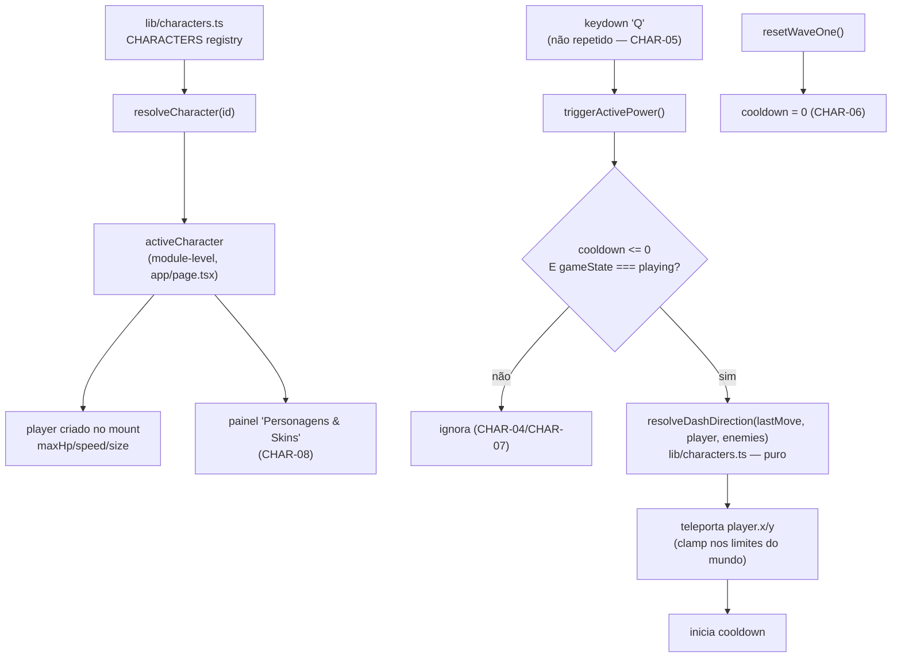

# Sistema de Personagens Design

**Spec**: `_docs/specs/features/sistema-personagens/spec.md`
**Status**: Draft

---

## Architecture Overview

O jogador hoje é um objeto literal criado uma única vez dentro do grande `useEffect` "motor do jogo" (`app/page.tsx:608-1861`), com `maxHp`/`speed`/`size` fixos no código. Essa arquitetura não muda: continua um único objeto `player`, criado uma vez, mutado a cada frame. A única mudança estrutural é **de onde vêm os números** — de um registry de personagens (`lib/characters.ts`, novo módulo puro) em vez de literais.

Como só 1 personagem entra nesta entrega (decisão do usuário) e não há seletor, `activeCharacter` é resolvido **uma única vez, em module scope** de `app/page.tsx` (não é estado React, não muda em runtime) — o mesmo padrão já usado para `adsenseClientId`/`adsenseBannerSlotId` no topo do arquivo. Isso evita construir estado/seleção que não tem consumidor nesta entrega (nenhum picker), mantendo o corte de escopo real. O ponto de extensão para o futuro é a *assinatura* de `resolveCharacter(id)` — pronta para receber um id dinâmico quando a UI de seleção existir — não um estado especulativo sem uso hoje.



---

## Code Reuse Analysis

### Existing Components to Leverage

| Component | Location | How to Use |
| --- | --- | --- |
| `normalize(x, y)` | `app/page.tsx:168` | Já usado para o vetor de movimento (`move`); o valor resultante (`move.x`/`move.y`) é capturado a cada frame como "última direção de movimento" para alimentar o dash. Não precisa duplicar a normalização do input — só guardar o resultado já calculado. |
| `clamp(value, min, max)` | `app/page.tsx:156` | Reaproveitado para limitar o destino do teleporte aos limites do mundo (mesmo padrão já usado em `spawnFinalChoices`, `update`). |
| `distance(a, b)` | `app/page.tsx:160` | Mesma fórmula (`Math.hypot`) reaproveitada — mas duplicada como função interna pura em `lib/characters.ts` (ver Risco R1 abaixo), não importada, porque `app/page.tsx` é arquivo de rota (AD-008: lógica pura sai de `app/page.tsx`, nunca o inverso). |
| Debug HUD (`debugBossHealth`, `debugPowerUpCount`, gate `isDebugAllowed()`) | `app/page.tsx:247-248`, `lib/debug.ts` | Mesmo padrão (elementos `role="status"`, só em `development`) estendido com dois novos campos de observabilidade (cooldown do poder e posição do jogador) — necessário para testar CHAR-03/04/05 sem ler pixels do canvas. Ver Tech Decisions. |
| `resetWaveOne()` | `app/page.tsx:754` | Já reseta `burstStamina`, `weaponLevel` etc a cada nova partida/"novo chamado" — ganha uma linha a mais para zerar o cooldown do poder (CHAR-06). |
| Painel "skins" já commitado | `app/page.tsx` (feature de cheat code desta sessão) | O placeholder "em construção" é substituído pelo conteúdo real; o gate (`iddqd`/`idkfa`, `menuPanel === "skins"`) não muda. |
| Padrão de teste MSW/render (`app/__tests__/hidden-menu.test.tsx`, `game-debug.test.tsx`) | `app/__tests__/` | Mesmo padrão de `render(<Home />)` + `fireEvent.keyDown` + `screen.getByRole` para os testes de integração desta feature. |

### Integration Points

| System | Integration Method |
| --- | --- |
| Motor do jogo (`useEffect` único, `app/page.tsx`) | `player` lê `activeCharacter.maxHp/speed/size` na criação (uma vez, no mount) — nenhuma mudança na forma como o efeito já funciona hoje. |
| Debug HUD (`lib/debug.ts` + estado React `debugBossHealth`-like) | Dois novos campos de status só-leitura, mesmo gate `isDebugAllowed()`. |
| Painel de menu "skins" | Troca de conteúdo estático (placeholder) por dados lidos de `activeCharacter`, sem mudar o mecanismo de abertura do painel. |

---

## Components

### `lib/characters.ts` (novo)

- **Purpose**: Registry de personagens (dados) + resolução de personagem + geometria pura do poder especial (direção do dash). Único lugar onde um personagem futuro é adicionado.
- **Location**: `lib/characters.ts`
- **Interfaces**:
  - `resolveCharacter(id: string | undefined): CharacterDefinition` — retorna a definição pelo `id`; cai no primeiro item do registry se `id` for `undefined` ou não existir (CHAR-02).
  - `resolveDashDirection(moveDirection: Vector2, player: Vector2, enemies: readonly Vector2[]): Vector2` — vetor unitário: usa `moveDirection` se não-zero; senão mira no inimigo mais próximo; senão `(0, -1)`. Função pura, sem acesso a DOM/canvas (Edge Cases da spec).
- **Dependencies**: nenhuma (módulo puro, sem I/O).
- **Reuses**: nenhuma dependência externa nova — replica localmente a fórmula de distância (`Math.hypot`) já usada em `app/page.tsx`, sem importar do arquivo de rota (ver Risco R1).

### `app/page.tsx` (modificado)

- **Purpose**: Consome o registry para inicializar o jogador e para acionar/renderizar o poder especial; sem mudança de responsabilidade do arquivo.
- **Mudanças**:
  - `const activeCharacter = resolveCharacter(DEFAULT_CHARACTER_ID);` — module scope, junto de `adsenseClientId`.
  - Criação do `player` (linha ~638) passa a ler `activeCharacter.maxHp/speed/size` em vez de `100/210/24`.
  - Novas variáveis de closure no motor do jogo: `abilityCooldownRemaining`, `lastMoveX`, `lastMoveY` (mesmo padrão de `burstStamina`).
  - `update(delta)`: decrementa `abilityCooldownRemaining`; grava `lastMoveX/lastMoveY = move.x/move.y` a cada frame (reaproveita o `move` já calculado).
  - Nova função `triggerActivePower()`: guarda de estado (`gameState === "playing"`) + guarda de cooldown + chama `resolveDashDirection` + `clamp` no destino + inicia cooldown.
  - `onKeyDown`: novo branch `if (event.key.toLowerCase() === "q" && !event.repeat) triggerActivePower();` (após a guarda `isTyping`).
  - `resetWaveOne()`: `abilityCooldownRemaining = 0;`.
  - Painel `menuPanel === "skins"`: conteúdo real (nome, atributos, poder) no lugar do placeholder.
  - Debug HUD: dois novos `role="status"` (cooldown do poder, posição do jogador), atrás do mesmo `isDebugAllowed()`.

---

## Data Models

### `CharacterSpecialPower`

```typescript
type CharacterSpecialPower = {
  id: string;
  name: string;
  description: string;
  cooldownSeconds: number;
  dashDistance: number;
};
```

### `CharacterDefinition`

```typescript
type CharacterDefinition = {
  id: string;
  name: string;
  maxHp: number;
  speed: number;
  size: number;
  specialPower: CharacterSpecialPower | null; // null = personagem sem poder (Edge Case da spec)
};
```

**Relationships**: `CHARACTERS: readonly CharacterDefinition[]` é o catálogo; `DEFAULT_CHARACTER_ID = CHARACTERS[0].id`. Adicionar um personagem = adicionar um objeto ao array (CHAR-09).

Catálogo inicial (1 entrada, CHAR-01):

```typescript
{
  id: "dev-pleno",
  name: "Dev Pleno",
  maxHp: 100,
  speed: 210,
  size: 24,
  specialPower: {
    id: "refactor-dash",
    name: "Refactor Dash",
    description: "Teleporte curto na direção do movimento.",
    cooldownSeconds: 6,
    dashDistance: 140,
  },
}
```

> `dashDistance: 140` é um valor de balanceamento arbitrário (não vem da spec) — ver Tech Decisions.

---

## Error Handling Strategy

| Error Scenario | Handling | User Impact |
| --- | --- | --- |
| `resolveCharacter` recebe id desconhecido/`undefined` | Fallback para `CHARACTERS[0]` (CHAR-02) | Nenhum — jogo carrega normalmente com o personagem padrão |
| `Q` pressionado durante cooldown | `triggerActivePower` retorna sem efeito (CHAR-04) | Nenhum feedback visual nesta entrega (ver Tech Decisions) — jogador percebe pela ausência de movimento |
| `Q` pressionado fora de `gameState === "playing"` | Guard de estado dentro de `triggerActivePower` (CHAR-07) | Nenhum |
| Dash levaria o jogador para fora do mundo | `clamp` no destino final (Edge Case da spec) | Jogador para na borda, nunca sai da arena |
| Personagem sem `specialPower` (futuro) | `triggerActivePower` checa `power` nulo antes de agir; painel mostra "Sem poder especial" (Edge Case da spec) | Nenhum erro, comportamento explícito |

---

## Risks & Concerns

| Concern | Location (file:line) | Impact | Mitigation |
| --- | --- | --- | --- |
| R1 — Duplicação da fórmula de distância (`Math.hypot`) entre `app/page.tsx:160` e `lib/characters.ts` | `app/page.tsx:160` | Baixo: são 2 linhas, mas duas fontes da mesma fórmula podem divergir se uma mudar sem a outra. | Aceito conscientemente: `app/page.tsx` é arquivo de rota (AD-008), não pode ser importado por `lib/`. Extrair um `lib/geometry.ts` compartilhado é over-engineering para 2 linhas de fórmula padrão (`Math.hypot`) — não faço isso nesta entrega. |
| R2 — `keydown` nativo dispara em auto-repeat quando uma tecla fica pressionada | `app/page.tsx` (handler `onKeyDown`, ~linha 1030) | Sem a guarda `event.repeat`, seguraria `Q` disparia o poder centenas de vezes por segundo (CHAR-05 quebrado). | Guard explícito `!event.repeat` no branch do `Q`, coberto por teste dedicado (dispara `repeat: true` como o *primeiro* evento e confirma que não ativa nada, isolando esse comportamento do bloqueio por cooldown). |
| R3 — Não há indicador visual de cooldown na UI real (fora do debug) | `app/page.tsx` (painel "skins" / HUD) | Jogador não vê quando o poder volta a ficar disponível, exceto tentando de novo. | Fora do escopo da spec (nenhuma AC pede medidor visual) — decisão deliberada, não omissão silenciosa. Ver Tech Decisions. |
| R4 — `player` é criado uma única vez no mount do motor do jogo; não há recriação por partida além de `resetWaveOne` | `app/page.tsx:638-649` | Se um seletor de personagem for adicionado no futuro, trocar de personagem só vai valer a partir da próxima *página recarregada*, não da próxima partida — porque `activeCharacter` é constante de módulo, não estado. | Aceitável para esta entrega (não há seletor). Registrado aqui para quando o CHAR-EXT (seletor futuro) for especificado: `activeCharacter` provavelmente vira `useState` + leitura em `resetWaveOne()`, não só na criação do `player`. |

---

## Tech Decisions (only non-obvious ones)

| Decision | Choice | Rationale |
| --- | --- | --- |
| `activeCharacter` é constante de módulo, não estado React | `const activeCharacter = resolveCharacter(DEFAULT_CHARACTER_ID);` no topo do arquivo | Não há seletor nesta entrega (decisão do usuário); estado React sem nenhum consumidor (`setSelectedCharacterId` nunca chamado) seria código morto e provavelmente falharia lint. O ponto de extensão é a assinatura de `resolveCharacter(id)`, não um estado especulativo. |
| CHAR-02 (fallback) é validado no nível do registry, não via integração no app | Teste unitário chama `resolveCharacter("id-inexistente")` diretamente | Como só existe 1 personagem e nenhuma UI seta um id inválido em runtime, testar isso via `app/page.tsx` seria artificial; o comportamento real mora inteiramente em `resolveCharacter`. |
| CHAR-11 (sem persistência) verificado por ausência, não por um teste de "ciclo de vida" | Nenhum código de leitura/escrita em `localStorage` é introduzido para seleção de personagem | Não há o que persistir — não existe estado de seleção nesta entrega. Verificação = grep/inspeção confirmando que nenhuma chave nova de `localStorage` foi criada, documentado na validação (não precisa de teste dedicado). |
| Observabilidade de teste: dois campos novos no debug HUD (`cooldown do poder`, `posição do jogador`) | `role="status"`, atrás de `isDebugAllowed()`, mesmo padrão de `debugBossHealth`/`debugPowerUpCount` | CHAR-03/04/05 exigem provar que o teleporte e o bloqueio por cooldown realmente aconteceram — não há outra forma de observar posição/cooldown do jogador sem ler pixels do canvas (mock de `getContext` não expõe estado). Mesmo precedente já estabelecido pelos debug status existentes. |
| `dashDistance = 140` (pixels) | Valor fixo no registry, não na spec | A spec só define "distância fixa"; 140px é ~35% da altura do mundo (540px), suficiente para esquivar de um inimigo sem atravessar a arena inteira. Ajustável depois sem mudar arquitetura. |
| Sem medidor de cooldown na UI de produção | Nenhum elemento visual novo fora do debug HUD | Nenhuma AC da spec pede isso; adicionar seria escopo além do pedido (coding-principles: "no features beyond what was asked"). |
| CHAR-12 (emenda, achado de `/code-review`): dash atravessa obstáculos | `triggerActivePower` só faz `clamp` nos limites do mundo, sem chamar `obstacleBlocksCircle` — decisão do usuário: manter, é intencional (habilidade de escape) | O código-review apontou a ausência de checagem de colisão com obstáculo como inconsistência com o movimento normal; o usuário decidiu que essa é a intenção do poder (diferenciá-lo do movimento comum), não um bug — formalizado como AC em vez de corrigido |

> Nenhuma decisão aqui estabelece uma convenção de projeto nova além do já registrado em `AD-008` (lógica pura fora de `app/page.tsx`) — que já está em `STATE.md`. Sem novo `AD-NNN` necessário.
